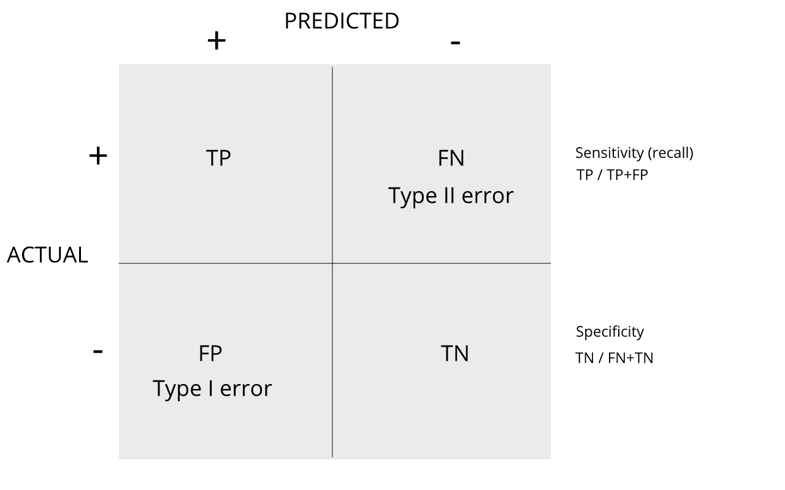

---
# Please do not edit this file directly; it is auto generated.
# Instead, please edit 04-procedures-for-multiple-testing.md in _episodes_rmd/
source: Rmd
title: "Procedures for Multiple Comparisons"
teaching: 10
exercises: 20
questions:
- "What are multiple comparisons?"
objectives:
- "Define multiple comparisons and the resulting problems."
keypoints:
- "..."
- "..."
math: yes
---

## Procedures

In the previous section we learned how p-values are no longer a useful quantity 
to interpret when dealing with high-dimensional data. This is because we are 
testing many _features_ at the same time. We refer to this as the 
_multiple comparison_ or _multiple testing_ or _multiplicity_ problem. The 
definition of a p-value does not provide a useful quantification here. Again, 
because when we test many hypotheses simultaneously, a list based simply on a 
small p-value cut-off of, say 0.01, can result in many false positives with high 
probability. Here we define terms that are more appropriate in the context of 
high-throughput data.

The most widely used approach to the multiplicity problem is to define a 
_procedure_ and then estimate or _control_ an informative _error rate_ for this 
procedure. What we mean by _control_ here is that we adapt the procedure to 
guarantee an _error rate_ below a predefined value. The procedures are typically 
flexible through parameters or cutoffs that let us control specificity and 
sensitivity. An example of a procedure is: 

* Compute a p-value for each gene.
* Call significant all genes with p-values smaller than $\alpha$.

Note that changing the $\alpha$ permits us to adjust specificity and 
sensitivity. 

Next we define the _error rates_  that we will try to estimate and control.

Review the matrix below to understand sensitivity, specificity, and error rates.

> ## Discussion
> Turn to a partner and explain the following:  
> Type I error  
> Type II error  
> sensitivity  
> specificity  
> When you are finished discussing,  share with the group in the collaborative
> document.
>
> > ## Solution
> >
> > 
> {: .solution}
{: .challenge}

For more on this, see [<i>Classification evaluation</i>](https://www.nature.com/articles/nmeth.3945) by J. Lever, 
M. Krzywinski and N. Altman in <i>Nature Methods</i> <b>13</b>, 603-604 (2016).

## Exercises
With these exercises we hope to help you further grasp the concept that p-values 
are random variables and start laying the ground work for the development of 
procedures that control error rates. The calculations to compute error rates 
require us to understand the random behavior of p-values.
We are going to ask you to perform some calculations related to introductory 
probability theory. One particular concept you need to understand is statistical 
independence. You also will need to know that the probability of two random e
vents that are statistically independent occurring is P (A and B) = P (A)P (B). 
This is a consequence of the more general formula P (A and B) = P (A)P (B|A).

> ## Exercise 1
> Assume the null is true and denote the p-value you would get if you ran a test
> as P. Define the function f (x) = Pr(P > x) . What does f (x) look like?   
> A) A uniform distribution.  
> B) The identity line.  
> C) A constant at 0.05.  
> D) P is not a random value.
> 
> > ## Solution
> > 
> {: .solution}
{: .challenge}

> ## Exercise 2
> In the previous exercises, we saw how the probability of incorrectly rejecting
> the null for at least one of 20 experiments for which the null is true, is 
> well over 5%. Now let’s consider a case in which we run thousands of tests, as 
> we would do in a high throughput experiment.
> We previously learned that under the null, the probability of a p-value < p is 
> p. If we run 8,793 independent tests, what it the probability of incorrectly 
> rejecting at least one of the null hypothesis?
> 
> > ## Solution
> > 
> {: .solution}
{: .challenge}

> ## Exercise 3
> Suppose we need to run 8,793 statistical tests and we want to make the 
> probability of a mistake very small, say 5%. Use the answer to Exercise 2 to 
> determine how small we have to change the cutoff, previously 0.05, to lower 
> our probability of at least one mistake to be 5%.
> 
> > ## Solution
> > 
> {: .solution}
{: .challenge}
