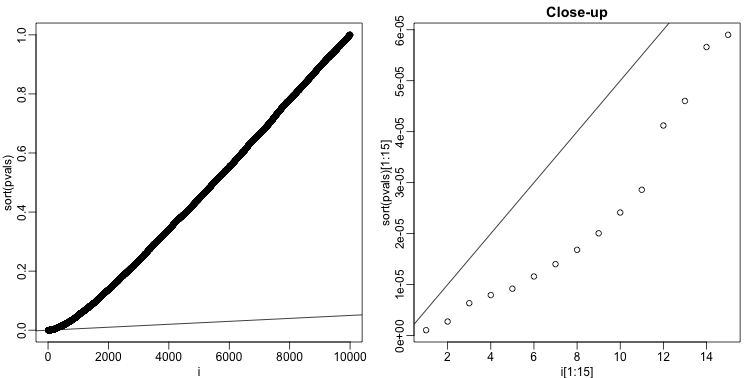

---
# Please do not edit this file directly; it is auto generated.
# Instead, please edit 07-false-discovery-rate.md in _episodes_rmd/
source: Rmd
title: "False Discovery Rate"
teaching: 30
exercises: 10
questions:
- "What are False Discovery Rates, and when are they a concern in data analysis?"
- "How can you control false discovery rates?"
objectives:
- "Calculate the false discovery rate."
- "Explain the limitations of restricting family wise error rates in a study."
keypoints:
- "Restricting FWER too much can cause researchers to reject the null hypothesis when it’s actually true. This is especially likely in the small samples used in discovery phase experiments. "
- "The Benjamini-Hochberg correction controls FDR by guaranteeing it to be below a desired alpha level."
- "FDR is a more liberal correction than Bonferroni. While it generates more false positives, it also provides more statistical power. "
math: yes
---

## False Discovery Rate 

There are many situations for which requiring an FWER of 0.05 does not make 
sense as it is much too strict. For example, consider the very common exercise 
of running a preliminary small study to determine a handful of candidate genes. 
This is referred to as a _discovery_ driven project or experiment. We may be in 
search of an unknown causative gene and more than willing to perform follow-up 
studies with many more samples on just the candidates. If we develop a procedure 
that produces, for example, a list of 10 genes of which 1 or 2 pan out as 
important, the experiment is a resounding success. With a small sample size, the 
only way to achieve a FWER $\leq$ 0.05 is with an empty list of genes. We 
already saw in the previous section that despite 1,000 diets being effective, we 
ended up with a list with just 2. Change the sample size to 6 and you very 
likely get 0:


```r
set.seed(1)
population <- unlist(read.csv(file = "../data/femaleControlsPopulation.csv"))
m <- 10000
p0 <- 0.90
m0 <- m*p0
m1 <- m-m0
nullHypothesis <- c( rep(TRUE,m0), rep(FALSE,m1)) 
delta <- 3
pvals <- sapply(1:m, function(i){
  control <- sample(population, 6)
  treatment <- sample(population, 6)
  if(!nullHypothesis[i]) treatment <- treatment + delta
  t.test(treatment, control)$p.value
  })
sum(pvals < 0.05/10000)
```

```
## [1] 0
```

By requiring a FWER $\leq$ 0.05, we are practically assuring 0 power 
(sensitivity). In many applications, this specificity requirement is over-kill. 
A widely used alternative to the FWER is the false discovery rate (FDR). The 
idea behind FDR is to focus on the random variable $Q \equiv V/R$ with $Q=0$ 
when $R=0$ and $V=0$. Note that $R=0$ (nothing called significant) implies $V=0$ 
(no false positives). So $Q$ is a random variable that can take values between 0 
and 1 and we can define a rate by considering the average of $Q$. To better 
understand this concept here, we compute $Q$ for the procedure: call everything 
p-value < 0.05 significant.

> ## Discussion
> Refer to the confusion matrix below showing false positive, false negative,
> and false discovery rates, along with specificity and sensitivity. Turn to a 
> partner and explain the following:  
> How is the false discovery rate related to Type I error and false positive 
> rates?  
> How is sensitivity related to the false discovery rate?  
> When you are finished discussing,  share with the group in the collaborative
> document.
>
> > ## Solution
> >
> > 
> {: .solution}
{: .challenge}


For more on this, see [<i>Classification evaluation</i>](https://www.nature.com/articles/nmeth.3945) by J. Lever, 
M. Krzywinski and N. Altman in <i>Nature Methods</i> <b>13</b>, 603-604 (2016).

#### Vectorizing code

Before running the simulation, we are going to _vectorize_ the code. This means 
that instead of using `sapply` to run `m` tests, we will create a matrix with 
all data in one call to sample. This code runs several times faster than the 
code above, which is necessary here due to the fact that we will be generating 
several simulations. Understanding this chunk of code and how it is equivalent 
to the code above using `sapply` will take a you long way in helping you code 
efficiently in R.


```r
library(genefilter) ##rowttests is here
alpha <- 0.05
N <- 12
set.seed(1)
##Define groups to be used with rowttests
g <- factor( c(rep(0, N), rep(1, N)) )
B <- 1000 ##number of simulations
Qs <- replicate(B, {
  ##matrix with control data (rows are tests, columns are mice)
  controls <- matrix(sample(population, N*m, replace=TRUE), nrow=m)
  
  ##matrix with control data (rows are tests, columns are mice)
  treatments <-  matrix(sample(population, N*m, replace=TRUE), nrow=m)
  
  ##add effect to 10% of them
  treatments[which(!nullHypothesis),] <- treatments[which(!nullHypothesis),] + delta
  
  ##combine to form one matrix
  dat <- cbind(controls, treatments)
  
 calls <- rowttests(dat, g)$p.value < alpha
 R=sum(calls)
 Q=ifelse(R > 0, sum(nullHypothesis & calls)/R, 0)
 return(Q)
})
```

#### Controlling FDR

The code above is a Monte Carlo simulation that generates 10,000 experiments 
1,000 times, each time saving the observed $Q$. Here is a histogram of these 
values:


```r
library(rafalib)
mypar(1, 1)
hist(Qs) ##Q is a random variable, this is its distribution
```


The FDR is the average value of $Q$

```r
FDR=mean(Qs)
print(FDR)
```

```
## [1] 0.4465395
```

The FDR is relatively high here. This is because for 90% of the tests, the null 
hypotheses is true. This implies that with a 0.05 p-value cut-off, out of 100 
tests we incorrectly call between 4 and 5 significant on average. This combined 
with the fact that we don't "catch" all the cases where the alternative is true, 
gives us a relatively high FDR. So how can we control this? What if we want 
lower FDR, say 5%?

To visually see why the FDR is high, we can make a histogram of the p-values. We 
use a higher value of `m` to have more data from the histogram. We draw a 
horizontal line representing the uniform distribution one gets for the `m0` 
cases for which the null is true. 


```r
set.seed(1)
controls <- matrix(sample(population, N*m, replace=TRUE), nrow=m)
treatments <-  matrix(sample(population, N*m, replace=TRUE), nrow=m)
treatments[which(!nullHypothesis),] <- treatments[which(!nullHypothesis),] + delta
dat <- cbind(controls, treatments)
pvals <- rowttests(dat, g)$p.value 

h <- hist(pvals, breaks=seq(0,1,0.05))
polygon(c(0,0.05,0.05,0), c(0,0,h$counts[1],h$counts[1]), col="lightsteelblue1")
abline(h=m0/20)
```


The first bar (grey) on the left represents cases with p-values smaller than 
0.05. From the horizontal line we can infer that about 1/2 are false positives. 
This is in agreement with an FDR of 0.50.  If we look at the bar for 0.01, we 
can see a lower FDR, as expected, but would call fewer features significant.


```r
h <- hist(pvals,breaks=seq(0,1,0.01))
polygon(c(0,0.01,0.01,0),c(0,0,h$counts[1],h$counts[1]),col="lightsteelblue1")
abline(h=m0/100)
```


As we consider a lower and lower p-value cut-off, the number of features 
detected decreases (loss of sensitivity), but our FDR also decreases (gain of 
specificity). So how do we decide on this cut-off? One approach is to set a 
desired FDR level $\alpha$, and then develop procedures that control the error 
rate: FDR  $\leq \alpha$.

#### Benjamini-Hochberg (Advanced)

We want to construct a procedure that guarantees the FDR to be below a certain 
level $\alpha$. For any given $\alpha$, the Benjamini-Hochberg (1995) procedure 
is very practical because it simply requires that we are able to compute 
p-values for each of the individual tests and this permits a procedure to be 
defined.

For this procedure, order the p-values in increasing order: $p_{(1)},\dots,p_{(m)}$. 
Then define $k$ to be the largest $i$ for which

$$p_{(i)} \leq \frac{i}{m}\alpha$$

The procedure is to reject tests with p-values smaller or equal to  $p_{(k)}$. 
Here is an example of how we would select the $k$ with code using the p-values 
computed above:


```r
alpha <- 0.05
i = seq(along=pvals)

mypar(1,2)
plot(i,sort(pvals))
abline(0,i/m*alpha)
##close-up
plot(i[1:15],sort(pvals)[1:15],main="Close-up")
abline(0,i/m*alpha)
```


```r
k <- max( which( sort(pvals) < i/m*alpha) )
cutoff <- sort(pvals)[k]
cat("k =",k,"p-value cutoff=",cutoff)
```

```
## k = 24 p-value cutoff= 0.0001197627
```



We can show mathematically that this procedure has FDR lower than 5%. Please see Benjamini-Hochberg (1995) for details. An important outcome is that we now have 
selected 11 tests instead of just 2. If we are willing to set an FDR of 50% 
(this means we expect at least 1/2 our genes to be hits), then this list grows 
to 1063. The FWER does not provide this flexibility since any list of 
substantial size will result in an FWER of 1.

Keep in mind that we don't have to run the complicated code above as we have 
functions to do this. For example, using the p-values `pvals` computed above,
we simply type the following:

```r
fdr <- p.adjust(pvals, method="fdr")
mypar(1,1)
plot(pvals,fdr,log="xy")
abline(h=alpha,v=cutoff) ##cutoff was computed above
```


We can run a Monte-Carlo simulation to confirm that the FDR is in fact lower 
than .05. We compute all p-values first, and then use these to decide which get 
called.


```r
alpha <- 0.05
B <- 1000 ##number of simulations. We should increase for more precision
res <- replicate(B,{
  controls <- matrix(sample(population, N*m, replace=TRUE),nrow=m)
  treatments <-  matrix(sample(population, N*m, replace=TRUE),nrow=m)
  treatments[which(!nullHypothesis),]<-treatments[which(!nullHypothesis),]+delta
  dat <- cbind(controls,treatments)
  pvals <- rowttests(dat,g)$p.value 
  ##then the FDR
  calls <- p.adjust(pvals,method="fdr") < alpha
  R=sum(calls)
  Q=ifelse(R>0,sum(nullHypothesis & calls)/R,0)
  return(c(R,Q))
})
Qs <- res[2,]
mypar(1,1)
hist(Qs) ##Q is a random variable, this is its distribution
```


```r
FDR=mean(Qs)
print(FDR)
```

```
## [1] 0.03641142
```


The FDR is lower than 0.05. This is to be expected because we need to be 
conservative to ensure the FDR $\leq$ 0.05 for any value of $m_0$, such as for 
the extreme case where every hypothesis tested is null: $m=m_0$. If you re-do 
the simulation above for this case, you will find that the FDR increases. 

We should also note that in ...

```r
Rs <- res[1,]
mean(Rs==0) * 100
```

```
## [1] 1.3
```
... percent of the simulations, we did not call any genes significant.

Finally, note that the `p.adjust` function has several options for error rate 
controlling procedures:

```r
p.adjust.methods
```

```
## [1] "holm"       "hochberg"   "hommel"     "bonferroni" "BH"        
## [6] "BY"         "fdr"        "none"
```
It is important to remember that these options offer not just different 
approaches to estimating error rates, but also that different error rates are 
estimated: namely FWER and FDR. This is an important distinction. More 
information is available from:


```r
?p.adjust
```

In summary, requiring that FDR $\leq$ 0.05 is a much more lenient requirement 
FWER $\leq$ 0.05. Although we will end up with more false positives, FDR gives 
us much more power. This makes it particularly appropriate for discovery phase 
experiments where we may accept FDR levels much higher than 0.05.

