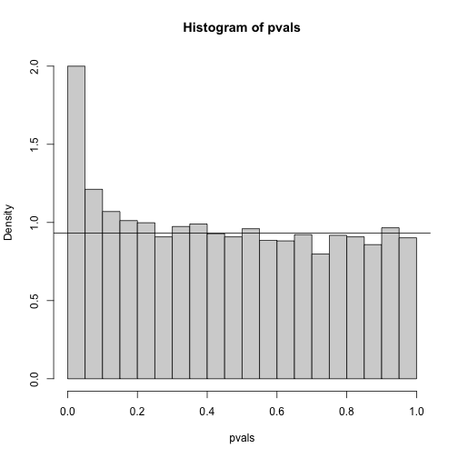

---
# Please do not edit this file directly; it is auto generated.
# Instead, please edit 08-direct-approach-false-discovery-rate.md in _episodes_rmd/
source: Rmd
title: "Direct Approach to FDR and q-values"
teaching: 20
exercises: 40
questions:
- "How can you control false discovery rates when you don't have an a priori error rate?"
objectives:
- "Apply the Storey correction to identify true negatives."
- "Explain the difference between the Storey correction and Benjamini-Hochberg approach."
keypoints:
- "The Storey correction makes different assumptions that Benjamini-Hochberg. It does not set a priori alpha levels, but instead estimates the number of true null hypotheses from a given data set."
- "The Storey correction is less computationally stable than Benjamini-Hochberg."
math: yes
---

## Direct Approach to FDR and q-values (Advanced)

Here we review the results described by John D. Storey in J. R. Statist. Soc. B 
(2002). One major distinction between Storey's approach and Benjamini and 
Hochberg's is that we are no longer going to set a $\alpha$ level a priori. 
Because in many high-throughput experiments we are interested in obtaining some 
list for validation, we can instead decide beforehand that we will consider all 
tests with p-values smaller than 0.01. We then want to attach an estimate of an 
error rate. Using this approach, we are guaranteed to have $R>0$. Note that in 
the FDR definition above we assigned $Q=0$ in the case that $R=V=0$. We were 
therefore computing: 

$$
\mbox{FDR} = E\left( \frac{V}{R} \mid R>0\right) \mbox{Pr}(R>0)
$$

In the approach proposed by Storey, we condition on having a non-empty list, 
which implies $R>0$, and we instead compute the _positive FDR_ 

$$
\mbox{pFDR} = E\left( \frac{V}{R} \mid R>0\right) 
$$

A second distinction is that while Benjamini and Hochberg's procedure controls 
under the worst case scenario, in which all null hypotheses are true 
( $m=m_0$ ), Storey proposes that we actually try to estimate $m_0$ from the 
data. Because in high-throughput experiments we have so much data, this is 
certainly possible. The general idea is to pick a relatively high value p-value 
cut-off, call it $\lambda$, and assume that tests obtaining p-values > $\lambda$ 
are mostly from cases in which the null hypothesis holds. We can then estimate 
$\pi_0 = m_0/m$ as: 

$$
\hat{\pi}_0 = \frac{\#\left\{p_i > \lambda \right\} }{ (1-\lambda) m }
$$

There are more sophisticated procedures than this, but they follow the same 
general idea. Here is an example setting $\lambda=0.1$. Using the p-values 
computed above we have:


```r
library(genefilter) ##rowttests is here
set.seed(1)
alpha <- 0.05
N <- 12

##Define groups to be used with rowttests
g <- factor( c(rep(0, N), rep(1, N)) )

# re-create p-values from earlier if needed
population <- unlist(read.csv(file = "../data/femaleControlsPopulation.csv"))
m <- 10000
p0 <- 0.90
m0 <- m*p0
m1 <- m-m0
nullHypothesis <- c( rep(TRUE,m0), rep(FALSE,m1)) 
delta <- 3

B <- 1000 ##number of simulations. We should increase for more precision 
res <- replicate(B, {
  controls <- matrix(sample(population, N*m, replace=TRUE),nrow=m)
  treatments <- matrix(sample(population, N*m, replace=TRUE),nrow=m)
  treatments[which(!nullHypothesis),]<-treatments[which(!nullHypothesis),]+delta 
  dat <- cbind(controls,treatments)
  pvals <- rowttests(dat,g)$p.value
  ##then the FDR
  calls <- p.adjust(pvals,method="fdr") < alpha
  R=sum(calls)
  Q=ifelse(R>0,sum(nullHypothesis & calls)/R,0)
  return(c(R,Q))
  }
  )
Qs <- res[2,]
```


```r
hist(pvals,breaks=seq(0,1,0.05),freq=FALSE)
```

```
## Error in hist(pvals, breaks = seq(0, 1, 0.05), freq = FALSE): object 'pvals' not found
```

```r
lambda = 0.1
pi0=sum(pvals> lambda) /((1-lambda)*m)
```

```
## Error in eval(expr, envir, enclos): object 'pvals' not found
```

```r
abline(h= pi0)
```

```
## Error in int_abline(a = a, b = b, h = h, v = v, untf = untf, ...): object 'pi0' not found
```

```r
print(pi0) ##this is close to the trye pi0=0.9
```

```
## Error in print(pi0): object 'pi0' not found
```



With this estimate in place we can, for example, alter the Benjamini and 
Hochberg procedures to select the $k$ to be the largest value so that: 

$$\hat{\pi}_0 p_{(i)} \leq \frac{i}{m}\alpha$$

However, instead of doing this, we compute a _q-value_ for each test. If a 
feature resulted in a p-value of $p$, the q-value is the estimated pFDR for a 
list of all the features with a p-value at least as small as $p$.

In R, this can be computed with the `qvalue` function in the `qvalue` package:


```r
library(qvalue)
res <- qvalue(pvals)
```

```
## Error in qvalue(pvals): object 'pvals' not found
```

```r
qvals <- res$qvalues
```

```
## Error in res$qvalues: $ operator is invalid for atomic vectors
```

```r
plot(pvals, qvals)
```

```
## Error in h(simpleError(msg, call)): error in evaluating the argument 'x' in selecting a method for function 'plot': object 'pvals' not found
```

we also obtain the estimate of $\hat{\pi}_0$:


```r
res$pi0
```

```
## Error in res$pi0: $ operator is invalid for atomic vectors
```
This function uses a more sophisticated approach at estimating $\pi_0$ than what 
is described above.

#### Note on estimating $\pi_0$
In our experience the estimation of $\pi_0$ can be unstable and adds a step of 
uncertainty to the data analysis pipeline. Although more conservative, the 
Benjamini-Hochberg procedure is computationally more stable. 

## Exercises
In the following exercises, we will define error controlling procedures for 
experimental data. We will make a list of genes based on q-values. We will also 
assess your understanding of false positives rates and false negative rates by 
asking you to create a Monte Carlo simulation.

> ## Exercise 1
> Load the gene expression data:  
> `library(GSE5859Subset)`  
> `data(GSE5859Subset)`  
> We are interested in comparing gene expression between the two groups defined 
> in the sampleInfo table.
> Compute a p-value for each gene using the function `rowttests` from the 
> genefilter package. 
> 
> `library(genefilter)`  
> `?rowttests`
> 
> How many genes have p-values smaller than 0.05?
> 
> > ## Solution
> > `g <- sampleInfo$group`  
> > `pvals <- rowttests(geneExpression, factor(g))$p.value`  
> > `sum(pvals < 0.05)`  
> {: .solution}
{: .challenge}

> ## Exercise 2
> Apply the Bonferroni correction to achieve a FWER of 0.05. How many genes are 
> called significant under this procedure?
> 
> > ## Solution
> > `m <- 8793`  
> > `sum(pvals < (0.05/m))`  
> {: .solution}
{: .challenge}

> ## Exercise 3
> The FDR is a property of a list of features, not each specific feature. The
> q-value relates FDR to individual features. To define the q-value, we order 
> features we tested by p-value, then compute the FDRs for a list with the most 
> significant, the two most significant, the three most significant, etc. The 
> FDR of the list with the, say, m most significant tests is defined as the 
> q-value of the m-th most significant feature. In other words, the q-value of a 
> feature, is the FDR of the biggest list that includes that gene.
> In R, we can compute q-values using the p.adjust function with the FDR option. 
> Read the help file for p.adjust and compute how many genes achieve a q-value < 
> 0.05 for our gene expression dataset.
> 
> > ## Solution
> > `pvals_adjust <- p.adjust(pvals, method = 'fdr')`  
> > `sum(pvals_adjust < 0.05)`  
> {: .solution}
{: .challenge}

> ## Exercise 4
> Now use the qvalue function, in the Bioconductor qvalue package, to estimate 
> q-values using the procedure described by Storey. How many genes have q-values 
> below 0.05?
> 
> > ## Solution
> > `res <- qvalue(pvals)`  
> > `sum(res$qvalues < 0.05)`  
> {: .solution}
{: .challenge}

> ## Exercise 5
> Read the help file for qvalue and report the estimated proportion of genes for 
> which the null hypothesis is true π0 = m0/m
> 
> > ## Solution
> > `res$pi0`  
> {: .solution}
{: .challenge}

> ## Exercise 6
> The number of genes passing the q-value < 0.05 threshold is larger with the
> q-value function than the p.adjust difference. Why is this the case? Make a 
> plot of the ratio of these two estimates to help answer the question.  
> A) One of the two procedures is flawed.  
> B) The two functions are estimating different things.  
> C) The qvalue function estimates the proportion of genes for which the null 
> hypothesis is true and provides a less conservative estimate.  
> D) The qvalue function estimates the proportion of genes for which the null
> hypothesis is true and provides a more conservative estimate.  
> 
> > ## Solution
> > `plot(pvals_adjust, res$qvalues, xlab = 'fdr', ylab = 'qval')`  
> > `abline(0,1)`  
> > The qvalue function estimates the proportion of genes for which the null 
> > hypothesis is true and provides a less conservative estimate (choice C).
> {: .solution}
{: .challenge}

> ## Exercise 7
> This exercise and the remaining ones are more advanced. Create a Monte Carlo
> Simulation in which you simulate measurements from 8,793 genes for 24 samples, 
> 12 cases and 12 controls. Then for 100 genes create a difference of 1 between 
> cases and controls. You can use the code provided below. Run this experiment 
> 1,000 times with a Monte Carlo simulation. For each instance, compute p-values 
> using a t-test and keep track of the number of false positives and false 
> negatives. Compute the false positive rate and false negative rates if we use 
> Bonferroni, q-values from p.adjust, and q-values from qvalue function. Set the 
> seed to 1 for all three simulations. What is the false positive rate for 
> Bonferroni? What are the false negative rates for Bonferroni?  
> `n <- 24`  
> `m <- 8793`  
> `mat <- matrix(rnorm(n*m),m,n)`  
> `delta <- 1`  
> `positives <- 500`  
> `mat[1:positives,1:(n/2)] <- mat[1:positives,1:(n/2)]+delta`  
> 
> > ## Solution
> > `g <- c(rep(0,12),rep(1,12))`  
> > `m <- 8793`  
> > `B <- 1000`  
> > `m1 <- 500`  
> > `N <- 12`  
> > `m0 <- m-m1`  
> > `nullHypothesis <- c(rep(TRUE,m0),rep(FALSE,m1))`  
> > `delta <- 1`  
> > 
> > `set.seed(1)`  
> > `res <- replicate(B, {`  
> > `  controls <- matrix(rnorm(N*m),nrow = m, ncol = N)`  
> > `  treatment <- matrix(rnorm(N*m),nrow = m, ncol = N)`  
> > `  treatment[!nullHypothesis,] <- `  
> > `    treatment[!nullHypothesis,] + delta`  
> > `  dat <- cbind(controls, treatment)`  
> > `  pvals <- rowttests(dat, factor(g))$p.value`  
> > `  calls <- pvals < (0.05/m)`  
> > `  R <- sum(calls)`  
> > `  V <- sum(nullHypothesis & calls)`  
> > `  fp <- sum(nullHypothesis & calls)/m0` # false positive  
> > `  fn <- sum(!nullHypothesis & !calls)/m1` # false negative  
> > `  return(c(fp,fn))`  
> > `})`  
> > `res<-t(res)`  
> > `head(res)`  
> > `mean(res[,1])` # false positive rate  
> > `mean(res[,2])` # false negative rate
> {: .solution}
{: .challenge}

> ## Exercise 8
> What are the false positive rates for p.adjust?  
> What are the false negative rates for p.adjust? 
> 
> > ## Solution
> > ~~~
> > g <- c(rep(0,12),rep(1,12))  
> > m <- 8793  
> > B <- 1000  
> > m1 <- 500  
> > N <- 12  
> > m0 <- m-m1  
> > nullHypothesis <- c(rep(TRUE,m0),rep(FALSE,m1))  
> > delta <- 1  
> > 
> > set.seed(1)  
> > res <- replicate(B, {  
> >   controls <- matrix(rnorm(N*m),nrow = m, ncol = N)  
> >   treatment <- matrix(rnorm(N*m),nrow = m, ncol = N)  
> >   treatment[!nullHypothesis,] <-   
> >     treatment[!nullHypothesis,] + delta  
> >   dat <- cbind(controls, treatment)  
> >   pvals <- rowttests(dat, factor(g))$p.value  
> >   pvals_adjust <- p.adjust(pvals, method = 'fdr')  
> >   calls <- pvals_adjust < 0.05  
> >   R <- sum(calls)  
> >   V <- sum(nullHypothesis & calls)  
> >   fp <- sum(nullHypothesis & calls)/m0 # false positive  
> >   fn <- sum(!nullHypothesis & !calls)/m1 # false negative  
> >   return(c(fp,fn))  
> > })  
> > res <- t(res)  
> > head(res)  
> > mean(res[,1]) # false positive rate  
> > mean(res[,2]) # false negative rate
> >  ~~~
> > {: .language-r}
> {: .solution}
{: .challenge}

> ## Exercise 9
> What are the false positive rates for qvalues?  
> What are the false negative rates for qvalues? 
> 
> > ## Solution
> > ~~~
> > g <- c(rep(0,12),rep(1,12))  
> > m <- 8793  
> > B <- 1000  
> > m1 <- 500  
> > N <- 12  
> > m0 <- m-m1  
> > nullHypothesis <- c(rep(TRUE,m0),rep(FALSE,m1))  
> > delta <- 1  
> > 
> > set.seed(1)  
> > res <- replicate(B, {  
> >   controls <- matrix(rnorm(N*m),nrow = m, ncol = N)  
> >   treatment <- matrix(rnorm(N*m),nrow = m, ncol = N)  
> >   treatment[!nullHypothesis,] <-   
> >     treatment[!nullHypothesis,] + delta  
> >   dat <- cbind(controls, treatment)  
> >   pvals <- rowttests(dat, factor(g))$p.value  
> >   qvals <- qvalue(pvals)$qvalue  
> >   calls <- qvals < 0.05  
> >   R <- sum(calls)  
> >   V <- sum(nullHypothesis & calls)  
> >   fp <- sum(nullHypothesis & calls)/m0 # false positive  
> >   fn <- sum(!nullHypothesis & !calls)/m1 # false negative  
> >   return(c(fp,fn))  
> > })  
> > res <- t(res)  
> > head(res)  
> > mean(res[,1]) # false positive rate  
> > mean(res[,2]) # false negative rate  
> >  ~~~
> > {: .language-r}
> {: .solution}
{: .challenge}
