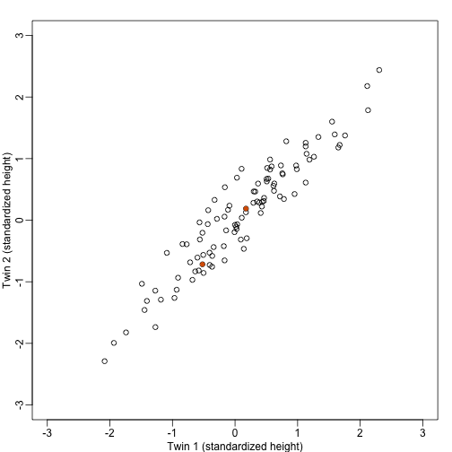

---
# Please do not edit this file directly; it is auto generated.
# Instead, please edit 10-principal-component-analysis.md in _episodes_rmd/
source: Rmd
title: "Principal Components Analysis"
teaching: 0
exercises: 0
questions:
- "How can researchers simplify or streamline EDA in high-throughput data sets?"
- "What is principal component analysis (PCA) and when can it be used?"
objectives:
- "Explain the purpose of dimension reduction."
- "Define a principal component."
- "Perform a principal components analysis."
keypoints:
- "Edit the ..."
- "Run ..."
math: yes
---

## Dimension Reduction Motivation

Visualizing data is one of the most, if not the most, important step in the 
analysis of high-throughput data. The right visualization method may reveal 
problems with the experimental data that can render the results from a standard 
analysis, although typically appropriate, completely useless. 

Recall that in recent history biologists went from using their eyes or simple 
summaries to categorize results, to having thousands (and now millions) of 
measurements per sample to analyze. Here we will focus on statistical inference 
in the context of high-throughput measurements, also called high-dimensional 
data. High-dimensional data is "wide" data, rather than long data, which has
few variables relative to the number of observations. The number of 
features (variables) in high-dimensional data is much greater than the number of
observations, making simple visualizations like scatterplots cumbersome.

We have shown methods for visualizing global properties of the columns or rows, 
but plots that reveal relationships between columns or between rows are more 
complicated due to the high dimensionality of data. For example, to compare each 
of the 189 samples to each other, we would have to create, for example, 17,766 
MA-plots. Creating one single scatterplot of the data is impossible since points 
are very high dimensional. 

We will describe powerful techniques for exploratory data analysis based on 
_dimension reduction_. The general idea is to reduce the dataset to have fewer 
dimensions, yet approximately preserve important properties, such as the 
distance between samples. If we are able to reduce down to, say, two dimensions, 
we can then easily make plots.

Principal component analysis (PCA) is a popular method of analyzing 
high-dimensional data. Large datasets of correlated variables can be summarized 
into smaller numbers of uncorrelated principal components that explain most of 
the variability in the original dataset. An example of PCA might be reducing 
several variables representing aspects of patient health (blood pressure, 
heart rate, respiratory rate) into a single feature.

PCA is a useful exploratory analysis tool. PCA allows us to reduce a large 
number of variables into a few features which represent most of the variation in 
the original variables. This makes exploration of the original variables easier.

The first principal component ($Z_1$) is calculated using the equation:

$$  
  Z_1 = a_{11}X_1 + a_{21}X_2 +....+a_{p1}X_p
$$

$X_1...X_p$ represents variables in the original dataset and $a_{11}...a_p$
represent principal component loadings, which can be thought of as the degree to
which each variable contributes to the calculation of the principal component.

> ## Exercise 1 
> 
> Descriptions of three datasets and research questions are given below. For
> which of these might PCA be considered a useful tool for analyzing data so
> that the research questions may be addressed?
> 
> 1. An epidemiologist has data collected from different patients admitted to
>    hospital with infectious respiratory disease. They would like to determine
>    whether length of stay in hospital differs in patients with different
>    respiratory diseases.
> 2. An online retailer has collected data on user interactions with its online
>    app and has information on the number of times each user interacted with
>    the app, what products they viewed per interaction, and the type and cost
>    of these products. The retailer would like to use this information to
>    predict whether or not a user will be interested in a new product.
> 3. A scientist has assayed gene expression levels in 1000 cancer patients and
>    has data from probes targeting different genes in tumour samples from
>    patients. She would like to create new variables representing relative
>    abundance of different groups of genes to i) find out if genes form
>    subgroups based on biological function and ii) use these new variables
>    in a linear regression examining how gene expression varies with disease
>    severity.
> 4. All of the above.
> 
> > ## Solution
> > 
> >
> > In the first case, a regression model would be more suitable; perhaps a
> > survival model.
> > In the second, again a regression model, likely linear or logistic, would
> > be more suitable.
> > In the third example, PCA can help to identify modules of correlated
> > features that explain a large amount of variation within the data.
> >
> > Therefore the answer here is 3.
> {: .solution}
{: .challenge}

# What is a principal component?


The first principal component is the direction of the data along which the
observations vary the most. The second principal component is the direction of
the data along which the observations show the next highest amount of variation.
The second principal component is a linear combination of the variables that
is uncorrelated with the first principal component. There are as many principal
components as there are variables in your dataset, but as we'll see, some are
more useful at explaining your data than others. By definition, the first
principal component explains more variation than other principal components.

The animation below illustrates how principal components are calculated from
data. You can imagine that the black line is a rod and each red dashed line is
a spring. The energy of each spring is proportional to its squared length. The
direction of the first principal component is the one that minimizes the total
energy of all of the springs. In the animation below, the springs pull the rod,
finding the direction of the first principal component when they reach
equilibrium. We then use the length of the springs from the rod as the first
principal component.
This is explained in more detail on [this Q&A website](https://stats.stackexchange.com/questions/2691/making-sense-of-principal-component-analysis-eigenvectors-eigenvalues).


#### Example: Reducing two dimensions to one

We consider an example with twin heights. Here we simulate 100 two dimensional 
points that represent the number of standard deviations each individual is from 
the mean height. Each point is a pair of twins:



To help with the illustration, think of this as high-throughput gene expression 
data with the twin pairs representing the $N$ samples and the two heights 
representing gene expression from two genes. 

We are interested in the distance between any two samples. We can compute this 
using `dist`. For example, here is the distance between the two orange points in 
the figure above:


```r
d=dist(t(y))
as.matrix(d)[1,2]
```

```
## [1] 1.140897
```

What if making two dimensional plots was too complex and we were only able to 
make 1 dimensional plots. Can we, for example, reduce the data to a one 
dimensional matrix that preserves distances between points?

If we look back at the plot, and visualize a line between any pair of points, 
the length of this line is the distance between the two points. These lines tend 
to go along the direction of the diagonal. We have seen before that we can 
"rotate" the plot so that the diagonal is in the x-axis by making a MA-plot 
instead:


```r
z1 = (y[1,]+y[2,])/2 #the sum 
z2 = (y[1,]-y[2,])   #the difference

z = rbind( z1, z2) #matrix now same dimensions as y

thelim <- c(-3,3)
mypar(1,2)

plot(y[1,],y[2,],xlab="Twin 1 (standardized height)",
     ylab="Twin 2 (standardized height)",
     xlim=thelim,ylim=thelim)
points(y[1,1:2],y[2,1:2],col=2,pch=16)

plot(z[1,],z[2,],xlim=thelim,ylim=thelim,xlab="Average height",ylab="Difference in height")
points(z[1,1:2],z[2,1:2],col=2,pch=16)
```


#### Example: Twin heights

We started the motivation for dimension reduction with a simulated example and 
showed a rotation that is very much related to PCA.


```r
mypar(1,1)
plot(t(Y), xlim=thelim, ylim=thelim,
     main=paste("Sum of squares :",round(crossprod(Y[1,]),1)))
abline(h=0)
apply(Y,2,function(y) segments(y[1],0,y[1],y[2],lty=2))
```

```
## NULL
```

```r
points(Y[1,],rep(0,ncol(Y)),col=2,pch=16,cex=0.75)
```


Can we find a direction with higher variability? 


```r
u <- matrix(c(1,-1)/sqrt(2),ncol=1)
w=t(u)%*%Y
mypar(1,1)
plot(t(Y),
     main=paste("Sum of squares:",round(tcrossprod(w),1)),xlim=thelim,ylim=thelim)
abline(h=0,lty=2)
abline(v=0,lty=2)
abline(0,-1,col=2)
Z = u%*%w
for(i in seq(along=w))
  segments(Z[1,i],Z[2,i],Y[1,i],Y[2,i],lty=2)
points(t(Z), col=2, pch=16, cex=0.5)
```


This relates to the difference between twins, which we know is small. The sum of 
squares confirms this.


```r
u <- matrix(c(1,1)/sqrt(2),ncol=1)
w=t(u)%*%Y
mypar()
plot(t(Y), main=paste("Sum of squares:",round(tcrossprod(w),1)),
     xlim=thelim, ylim=thelim)
abline(h=0,lty=2)
abline(v=0,lty=2)
abline(0,1,col=2)
points(u%*%w, col=2, pch=16, cex=1)
Z = u%*%w
for(i in seq(along=w))
  segments(Z[1,i], Z[2,i], Y[1,i], Y[2,i], lty=2)
points(t(Z),col=2,pch=16,cex=0.5)
```


This is a re-scaled average height, which has higher sum of squares. There is a 
mathematical procedure for determining which $\mathbf{v}$ maximizes the sum of 
squares and the SVD provides it for us.

#### `prcomp`

R has a function specifically designed to find the principal components. In this 
case, the data is centered by default. The following function: 


```r
pc <- prcomp( t(Y) )
```

The loadings can be found this way:

```r
pc$rotation
```

```
##            PC1        PC2
## [1,] 0.7072304  0.7069831
## [2,] 0.7069831 -0.7072304
```

The equivalent of the variance explained is included in the: 

```r
pc$sdev
```

```
## [1] 1.2542672 0.2141882
```
component.

We take the transpose of `Y` because `prcomp` assumes the previously discussed 
ordering: units/samples in row and features in columns.


