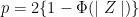
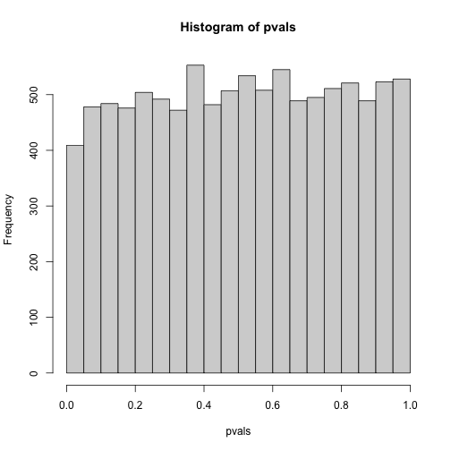
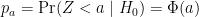
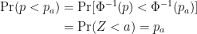
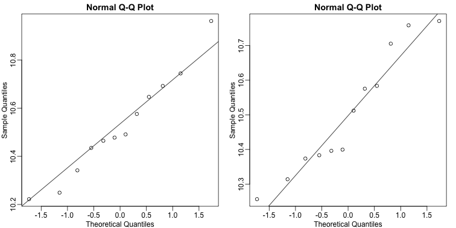
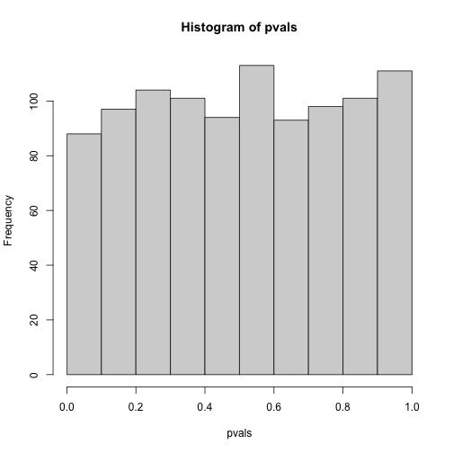

## Inference in Practice

Suppose we were given high-throughput gene expression data that was measured for 
several individuals in two populations. We are asked to report which genes have 
different average expression levels in the two populations. If instead of 
thousands of genes, we were handed data from just one gene, we could simply 
apply the inference techniques that we have learned before. We could, for 
example, use a t-test or some other test. Here we review what changes when we 
consider high-throughput data.

#### p-values are random variables

An important concept to remember in order to understand the concepts presented 
in this chapter is that p-values are random variables. Let’s revisit random 
variables as addressed in 
[this Statistical Inference for Biology episode](https://smcclatchy.github.io/statistical-inference-for-biology/02-inference-rv-dists/index.html).
We have a dataset that we imagine contains the weights of all control female 
mice. We refer to this as the population, even though it is impossible to have 
data for all mice in population. For illustrative purposes we imagine having 
access to an entire population, though in practice we cannot.

To illustrate a random variable, sample 12 mice from the population three times 
and watch how the average changes.

```{r load_data}
population <- read.csv(file = "../data/femaleControlsPopulation.csv")
```


```{r sample_means}
control <- sample(population$Bodyweight, 12)
mean(control)
control <- sample(population$Bodyweight, 12)
mean(control)
control <- sample(population$Bodyweight, 12)
mean(control)
```

Notice that the mean is a random variable. To explore p-values as random 
variables, consider the example in which we define a p-value from a t-test with 
a large enough sample size to use the 
[Central Limit Theorem (CLT) approximation](https://smcclatchy.github.io/statistical-inference-for-biology/04-inference-clt/index.html). 
The CLT says that when the sample size is large, the average Y&#772; of a random 
sample follows a normal distribution centered at the population average 
&mu;<sub>Y</sub> and with standard deviation equal to the population standard 
deviation &sigma;<sub>Y</sub>, divided by the square root of the sample size 
*N*.Then our p-value is 
defined as the probability that a normally distributed random variable is 
larger, in absolute value, [than the observed t-test](https://smcclatchy.github.io/statistical-inference-for-biology/06-inference-ttests-practice/index.html), 
call it <i>Z</i>. Recall that a t-statistic is the ratio of the observed effect
size and the standard error. Because it’s the ratio of two random variables, it
too is a random variable. So for a two sided test the p-value is: 

 

In R, we write:
```{r, eval=FALSE}
2 * (1 - pnorm(abs(Z)))
```

Now because <i>Z</i> is a random variable and <i>&Phi;</i> is a deterministic
function, <i>p</i> is also a random variable. We will create a Monte Carlo
simulation showing how the values of <i>p</i> change. 

We use `replicate` to repeatedly create p-values.

```{r pvalue_hist, eval=FALSE}
set.seed(1)
N <- 12
B <- 10000
pvals <- replicate(B, {
  control = sample(population, N)
  treatment = sample(population, N)
  t.test(treatment, control)$p.val 
  })
hist(pvals)
```
 
As implied by the histogram, in this case the distribution of the p-value is 
uniformly distributed. In fact, we can show theoretically that when the null 
hypothesis is true, this is always the case. For the case in which we use the 
CLT, we have that the null hypothesis <i>H<sub>0</sub></i> implies that our test statistic <i>Z</i> follows a normal distribution with mean 0 and SD 1 thus:

 
This implies that:



which is the definition of a uniform distribution.

#### Thousands of tests

In this data we have two groups denoted with 0 and 1:
```{r}
library(GSE5859Subset)
data(GSE5859Subset)
g <- sampleInfo$group
g
```

If we were interested in a particular gene, let's arbitrarily pick the one on 
the 25th row, we would simply compute a t-test. To compute a p-value, we will 
use the t-distribution approximation and therefore we need the population data 
to be approximately normal. Recall that when the CLT does not apply (e.g. when
sample sizes aren't large enough), we can 
[use the t-distribution](https://smcclatchy.github.io/statistical-inference-for-biology/06-inference-ttests-practice/index.html).

We check our assumption that the population is normal with a qq-plot:

```{r qqplots_for_one_gene, eval=FALSE}
e <- geneExpression[25, ]

library(rafalib)
mypar(1,2)

qqnorm(e[g==1])
qqline(e[g==1])

qqnorm(e[g==0])
qqline(e[g==0])
```
 
The qq-plots show that the data is well approximated by the normal 
approximation. The t-test does not find this gene to be statistically 
significant:

```{r}
t.test(e[g==1], e[g==0])$p.value
```

To answer the question for each gene, we simply repeat the above for each gene. 
Here we will define our own function and use `apply`:

```{r}
myttest <- function(x) 
  t.test(x[g==1], 
         x[g==0], 
         var.equal=TRUE)$p.value
pvals <- apply(geneExpression, 1, myttest)
```

We can now see which genes have p-values less than, say, 0.05. For example, 
right away we see that...

```{r}
sum(pvals < 0.05)
```

... genes had p-values less than 0.05.

However, as we will describe in more detail below, we have to be careful in 
interpreting this result because we have performed over 8,000 tests. If we 
performed the same procedure on random data, for which the null hypothesis is 
true for all features, we obtain the following results:

```{r}
set.seed(1)
m <- nrow(geneExpression)
n <- ncol(geneExpression)
randomData <- matrix(rnorm(n * m), m, n)
nullpvals <- apply(randomData, 1, myttest)
sum(nullpvals < 0.05)
```

> ## Discussion
> Turn to a partner and explain what you did and found in the previous two 
> analyses. What do you think the results mean? Then, share your responses with 
> the group through the collaborative document.
>
> > ## Solution
> >
> {: .solution}
{: .challenge}

As we will explain later in the chapter, this is to be expected: 419 is roughly 
0.05 * 8192 and we will describe the theory that tells us why this prediction 
works.

#### Faster t-test implementation

Before we continue, we should point out that the above implementation is very inefficient. There are several faster implementations that perform t-test for high-throughput data. We make use of a function that is not available from CRAN, 
but rather from the Bioconductor project. 

To download and install packages from Bioconductor, we can use the `install_bioc` function in `rafalib` to install the package:


```{r, eval=FALSE}
install_bioc("genefilter")
```
Now we can show that this function is much faster than our code above and 
produce practically the same answer:

```{r, message=FALSE}
library(genefilter)
results <- rowttests(geneExpression, factor(g))
max(abs(pvals - results$p))
```

## Exercises
These exercises will help clarify that p-values are random variables and some of 
the properties of these p-values. Note that just like the sample average is a 
random variable because it is based on a random sample, the p-values are based 
on random variables (sample mean and sample standard deviation for example) and 
thus it is also a random variable.  
To see this, let’s see how p-values change when we take different samples.

```{r p_value_head}
set.seed(1)
pvals <- replicate(1000, { # recreate p-values as from above
  control = sample(population, 12) 
  treatment = sample(population, 12) 
  t.test(treatment,control)$p.val
  }
  )
head(pvals)
```

```{r p_value_histogram, eval=FALSE}
hist(pvals)
```

 
> ## Exercise 1: What proportion of the p-values is below 0.05?
>
> > ## Solution
> > `sum(pvals < 0.05)/length(pvals)`  
> > `r sum(pvals < 0.05)` of the p-values are less than 0.05 of a total  
> > `r length(pvals)` p-values
> {: .solution}
{: .challenge}

> ## Exercise 2: What proportion of the p-values is below 0.01?
>
> > ## Solution
> > `sum(pvals < 0.01)/length(pvals)`  
> > `r sum(pvals < 0.01)` of the p-values are less than 0.01 of a total  
> > `r length(pvals)` p-values
> {: .solution}
{: .challenge}

> ## Exercise 3
> Assume you are testing the effectiveness of 20 diets on mice weight. For each 
> of the 20 diets, you run an experiment with 10 control mice and 10 treated 
> mice. Assume the null hypothesis, that the diet has no effect, 
> is true for all 20 diets and that mice weights follow a normal distribution, 
> with mean 30 grams and a standard deviation of 2 grams. Run a Monte Carlo 
> simulation for one of these studies:
>
>  ```{r}
>  cases = rnorm(10, 30, 2)
>  controls = rnorm(10, 30, 2) 
>  t.test(cases, controls)     
>  ```
>
>  Now run a Monte Carlo simulation imitating the results for the experiment for 
>  all 20 diets. If you set the seed at 100, set.seed(100), how many of p-values 
>  are below 0.05?
>
> > ## Solution
> > `set.seed(100)`  
> > `n <- 20`
> > `null <- vector("numeric", n)`
> > `for (i in 1:n) {`
> > `cases = rnorm(10, 30, 2)`
> > `controls = rnorm(10, 30, 2) `
> > `null[i] <- t.test(cases, controls)$p.val` 
> > `}`
> > 
> > 
> > 
> > 
> > 
> > 
> {: .solution}
{: .challenge}

> ## Exercise 4
> Now create a simulation to learn about the distribution of the 
> number of p-values that are less than 0.05. In question 3, we ran the 20 diet 
> experiment once. Now we will run the
> experiment 1,000 times and each time save the number of p-values that are less 
> than 0.05.
> Set the seed at 100, set.seed(100), run the code from Question 3 1,000 times, 
> and save the number of times the p-value is less than 0.05 for each of the 
> 1,000 instances. What is the average of these numbers? This is the expected 
> number of tests (out of the 20 we run) that we will reject when the null is 
> true.
>
> > ## Solution
> >
> {: .solution}
{: .challenge}

> ## Exercise 5
> What this says is that on average, we expect some p-value to be 0.05 even when 
> the null is true for all diets. Use the same simulation data and report for 
> what percent of the 1,000 replications did we make more than 0 false 
> positives?
> 
> > ## Solution
> >
> {: .solution}
{: .challenge}
