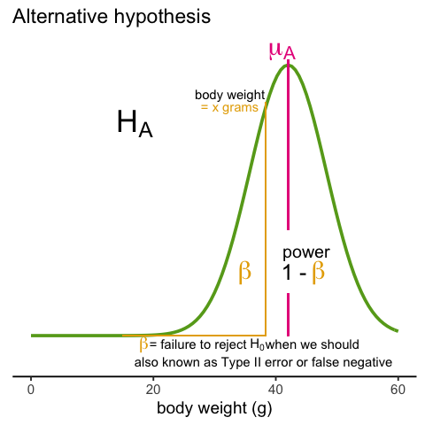
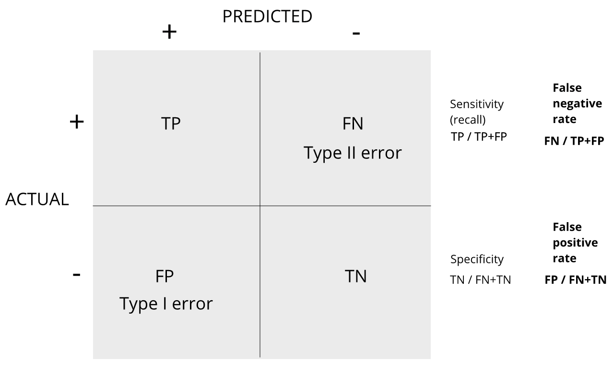

## Error Rates

Throughout this section we will be using the type I error and type II error 
terminology. We will also refer to them as false positives and false negatives 
respectively. We also use the more general terms specificity, which relates to 
type I error, and sensitivity, which relates to type II errors.

#### Types of Error
Whenever we perform a statistical test, we are aware that we may make a mistake. 
This is why our p-values are not 0. Under the null, there is always a positive, 
perhaps very small, but still positive chance that we will reject the null when 
it is true. If the p-value is 0.05, it will happen 1 out of 20 times. This 
*error* is called _type I error_ by statisticians.  


A type I error is defined as rejecting the null when we should not. This is also 
referred to as a false positive. So why do we then use 0.05? Shouldn't we use 
0.000001 to be really sure? The reason we don't use infinitesimal cut-offs to 
avoid type I errors at all cost is that there is another error we can commit: to 
not reject the null when we should. This is called a _type II error_ or a false 
negative. 




In the context of high-throughput data we can make several type I errors and 
several type II errors in one experiment, as opposed to one or the other as seen 
in Chapter 1. In this table, we summarize the possibilities using the notation 
from the seminal paper by Benjamini-Hochberg:

|   | Called significant   | Not called significant   | Total  |  
|---|---|---|---|
|Null True   | $V$   | $m_0-V$  | $m_0$  |
|Alternative True   | $S$  | $m_1-S$    | $m_1$    |   
|True   | $R$  |  $m-R$ | $m$  |

To describe the entries in the table, let's use as an example a dataset 
representing measurements from 10,000 genes, which means that the total number 
of tests that we are conducting is: $m=10,000$. The number of genes for which 
the null hypothesis is true, which in most cases represent the "non-interesting" 
genes, is $m_0$, while the number of genes for which the null hypothesis is 
false is $m_1$. For this we can also say that the _alternative hypothesis_ is 
true. In general, we are interested in _detecting_ as many as possible of the 
cases for which the alternative hypothesis is true (true positives), without 
incorrectly detecting cases for which the null hypothesis is true (false 
positives). For most high-throughput experiments, we assume that $m_0$ is much 
greater than $m_1$. For example, we test 10,000 expecting 100 genes or less to 
be _interesting_. This would imply that $m_1 \leq 100$ and $m_0 \geq 19,900$. 

Throughout this chapter we refer to _features_ as the units being tested. In 
genomics, examples of features are genes, transcripts, binding sites, CpG sites, 
and SNPs. In the table, $R$ represents the total number of features that we call 
significant after applying our procedure, while $m-R$ is the total number of 
genes we don't call significant. The rest of the table contains important 
quantities that are unknown in practice.

* $V$ represents the number of type I errors or false positives. Specifically, 
$V$ is the number of features for which the null hypothesis is true, that we 
call significant.
* $S$ represents the number of true positives. Specifically, $S$ is the number 
of features for which the alternative is true, that we call significant. 

This implies that there are $m_1-S$ type II errors or _false negatives_ and 
$m_0-V$ true negatives. Keep in mind that if we only ran one test, a p-value is 
simply the probability that $V=1$ when $m=m_0=1$. Power is the probability of 
$S=1$ when $m=m_1=1$. In this very simple case, we wouldn't bother making the 
table above, but now we show how defining the terms in the table helps for the 
high-dimensional setting.

  
#### Data example

Let's compute these quantities with a data example. We will use a Monte Carlo 
simulation using our mice data to imitate a situation in which we perform tests 
for 10,000 different fad diets, none of them having an effect on weight. This 
implies that the null hypothesis is true for diets and thus $m=m_0=10,000$ and 
$m_1=0$. Let's run the tests with a sample size of $N=12$ and compute $R$. Our 
procedure will declare any diet achieving a p-value smaller than $\alpha=0.05$ 
as significant. 

```{r, echo=FALSE}
library(downloader)
url <- "https://raw.githubusercontent.com/genomicsclass/dagdata/master/inst/extdata/femaleControlsPopulation.csv"
filename <- "femaleControlsPopulation.csv"
if (!file.exists(filename)) download(url,destfile=filename)
```


```{r}
set.seed(1)
population = unlist( read.csv("femaleControlsPopulation.csv") )
alpha <- 0.05
N <- 12
m <- 10000
pvals <- replicate(m,{
  control = sample(population,N)
  treatment = sample(population,N)
  t.test(treatment,control)$p.value
})
```

Although in practice we do not know the fact that no diet works, in this 
simulation we do, and therefore we can actually compute $V$ and $S$. Because all 
null hypotheses are true, we know, in this specific simulation, that $V=R$. Of 
course, in practice we can compute $R$ but not $V$.

```{r}
sum(pvals < 0.05)
```

These many false positives are not acceptable in most contexts.

Here is more complicated code showing results where 10% of the diets are 
effective with an average effect size of $\Delta= 3$ ounces. 
Studying this code carefully will help us understand the meaning of the table 
above.
First let's define _the truth_:

```{r}
alpha <- 0.05
N <- 12
m <- 10000
p0 <- 0.90 ##10% of diets work, 90% don't
m0 <- m * p0
m1 <- m - m0
nullHypothesis <- c( rep(TRUE, m0), rep(FALSE, m1))
delta <- 3
```

Now we are ready to simulate 10,000 tests, perform a t-test on each, and record 
if we rejected the null hypothesis or not:

```{r}
set.seed(1)
calls <- sapply(1:m, function(i){
  control <- sample(population, N)
  treatment <- sample(population, N)
  if(!nullHypothesis[i]) treatment <- treatment + delta
  ifelse( t.test(treatment, control)$p.value < alpha, 
          "Called Significant",
          "Not Called Significant")
})
```

Because in this simulation we know the truth (saved in `nullHypothesis`), we can 
compute the entries of the table:

```{r}
null_hypothesis <- factor(nullHypothesis, levels=c("TRUE", "FALSE"))
table(null_hypothesis, calls)
```

The first column of the table above shows us $V$ and $S$. Note that $V$ and $S$ 
are random variables. If we run the simulation repeatedly, these values change. 
Here is a quick example:

```{r}
B <- 10 ##number of simulations
VandS <- replicate(B,{
  calls <- sapply(1:m, function(i){
    control <- sample(population, N)
    treatment <- sample(population, N)
    if(!nullHypothesis[i]) treatment <- treatment + delta
    t.test(treatment, control)$p.val < alpha
  })
  cat("V =",sum(nullHypothesis & calls), "S =",sum(!nullHypothesis & calls),"\n")
  c(sum(nullHypothesis & calls),sum(!nullHypothesis & calls))
  })
```

This motivates the definition of error rates. We can, for example, estimate 
probability that $V$ is larger than 0. This is interpreted as the probability of 
making at least one type I error among the 10,000 tests. In the simulation 
above, $V$ was much larger than 1 in every single simulation, so we suspect this 
probability is very practically 1. When $m=1$, this probability is equivalent to 
the p-value. When we have a multiple tests situation, we call it the Family Wise 
Error Rate (FWER) and it relates to a technique that is widely used: The 
Bonferroni Correction.

> ## Discussion
> Refer to the confusion matrix below showing false positive and false negative
> rates, along with specificity and sensitivity. Turn to a partner and explain 
> the following:  
> How is specificity related to Type I error and false positive rates?  
> How is sensitivity related to Type II error and false negative rates?  
> When you are finished discussing,  share with the group in the collaborative
> document.
>
> > ## Solution
> >
> > 
> {: .solution}
{: .challenge}



For more on this, see [<i>Classification evaluation</i>](https://www.nature.com/articles/nmeth.3945) by J. Lever, 
M. Krzywinski and N. Altman in <i>Nature Methods</i> <b>13</b>, 603-604 (2016).