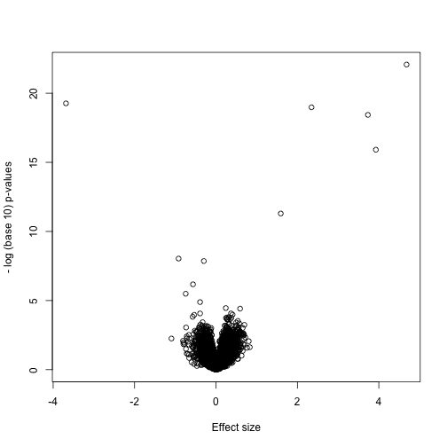
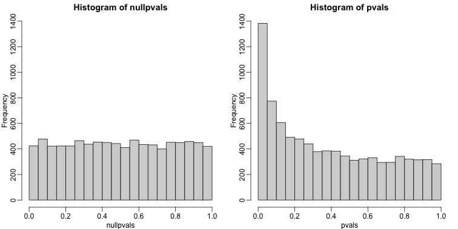
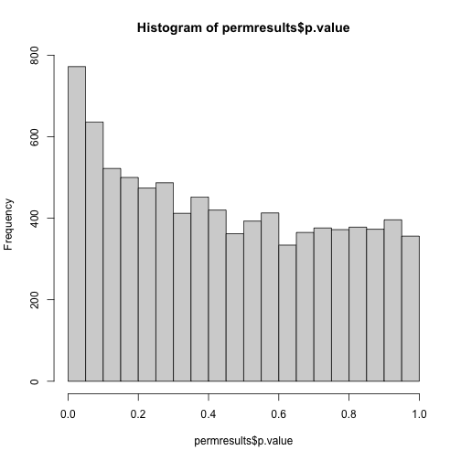
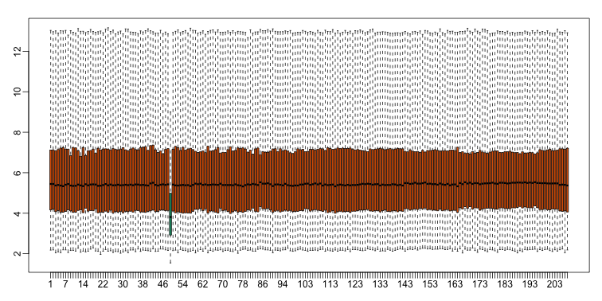
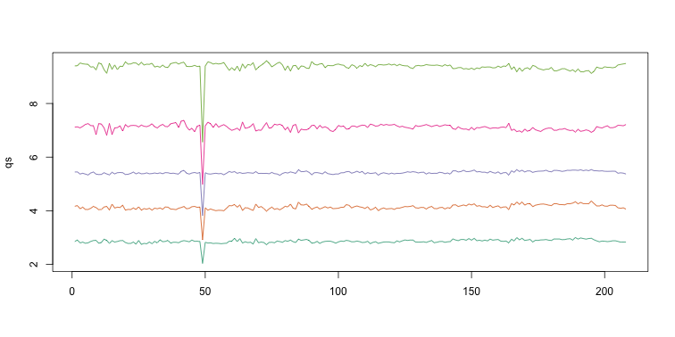
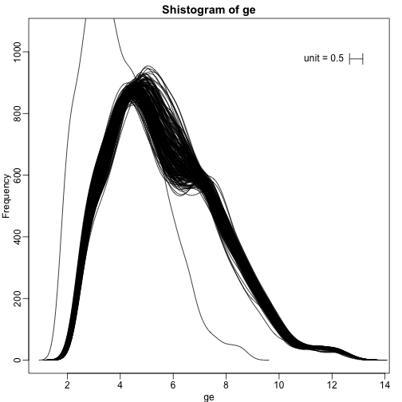
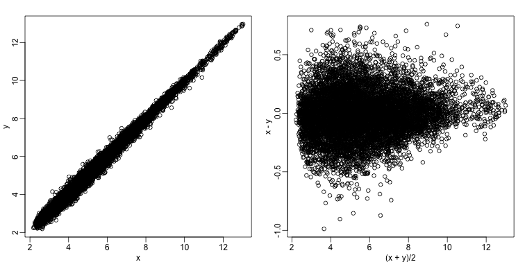
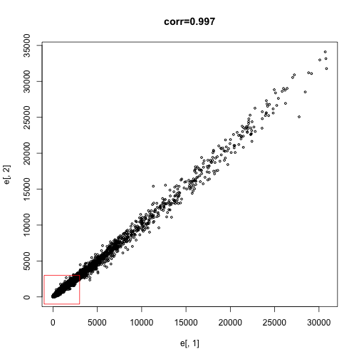

## Basic Exploratory Data Analysis 

An under-appreciated advantage of working with high-throughput data is that 
problems with the data are sometimes more easily exposed than with 
low-throughput data. The fact that we have thousands of measurements permits us 
to see problems that are not apparent when only a few measurements are 
available. A powerful way to detect these problems is with exploratory data 
analysis (EDA). Here we review some of the plots that allow us to detect quality 
problems.


#### Volcano plots

Here we will use the results obtained from applying t-test to data from a gene 
expression dataset:

```{r,message=FALSE}
library(genefilter)
library(GSE5859Subset)
data(GSE5859Subset)
g <- factor(sampleInfo$group)
results <- rowttests(geneExpression, g)
pvals <- results$p.value
```

And we also generate p-values from a dataset for which we know the null is true:

```{r}
m <- nrow(geneExpression)
n <- ncol(geneExpression)
randomData <- matrix(rnorm(n * m), m, n)
nullpvals <- rowttests(randomData, g)$p.value
```

As we described earlier, reporting only p-values is a mistake when we can also 
report effect sizes. With high-throughput data, we can visualize the results by 
making a _volcano plot_. The idea behind a volcano plot is to show these for all 
features. In the y-axis we plot -log (base 10) p-values and on the x-axis we 
plot the effect size. By using -log (base 10), the "highly significant" features 
appear at the top of the plot. Using log also permits us to better distinguish 
between small and very small p-values, for example 0.01 and $10^6$.  Here is the 
volcano plot for our results above:

```{r volcano_plot, fig.align=""}
plot(results$dm,-log10(results$p.value),
     xlab="Effect size",ylab="- log (base 10) p-values")
```



Many features with very small p-values, but small effect sizes as we see here, 
are sometimes indicative of problematic data.

#### p-value Histograms

Another plot we can create to get an overall idea of the results is to make 
histograms of p-values. When we generate completely null data the histogram 
follows a uniform distribution. With our original dataset we see a higher 
frequency of smaller p-values. 

```{r pval-hist, fig.cap="",fig.width=10.5,fig.height=5.25}
library(rafalib)
mypar(1,2)
hist(nullpvals,ylim=c(0,1400))
hist(pvals,ylim=c(0,1400))
```



When we expect most hypotheses to be null and don't see a uniform p-value 
distribution, it might be indicative of unexpected properties, such as 
correlated samples. 

If we permute the outcomes and calculate p-values then, if the samples are 
independent, we should see a uniform distribution. With these data we do not:

```{r pval-hist2, fig.cap=""}
permg <- sample(g)
permresults <- rowttests(geneExpression,permg)
hist(permresults$p.value)
```



In a later chapter we will see that the columns in this dataset are not 
independent and thus the assumptions used to compute the p-values here are 
incorrect.

#### Data boxplots and histograms

With high-throughput data, we have thousands of measurements for each 
experimental unit. As mentioned earlier, this can help us detect quality issues. 
For example, if one sample has a completely different distribution than the 
rest, we might suspect there are problems. Although a complete change in 
distribution could be due to real biological differences, more often than not it 
is due to a technical problem. Here we load a large gene expression experiment 
available on Github. We "accidentally" use log instead of log2 on one of the 
samples.

```{r, message=FALSE}
library(devtools)
library(Biobase)
install_github("genomicsclass/GSE5859")
library(GSE5859) 
data(GSE5859) 
ge <- exprs(e) ##ge for gene expression
ge[,49] <- ge[,49]/log2(exp(1)) ##imitate error
```

A quick look at a summary of the distribution using boxplots immediately 
highlights the mistake:

```{r boxplots, fig.cap="",fig.width=10.5,fig.height=5.25}
library(rafalib)
mypar(1,1)
boxplot(ge,range=0,names=1:ncol(e),col=ifelse(1:ncol(ge)==49,1,2))
```




Note that the number of samples is a bit too large here, making it hard to see 
the boxes. One can instead simply show the boxplot summaries without the boxes:

```{r kaboxplot, fig.cap="",fig.width=10.5,fig.height=5.25}
qs <- t(apply(ge,2,quantile,prob=c(0.05,0.25,0.5,0.75,0.95)))
matplot(qs,type="l",lty=1)
```



We refer to this figure as a _kaboxplot_ because Karl Broman was the first we 
saw use it as an alternative to boxplots.

We can also plot all the histograms. Because we have so much data, we create 
histograms using small bins, then smooth the heights of the bars and then plot 
_smooth histograms_. We re-calibrate the height of these smooth curves so that 
if a bar is made with base of size "unit" and height given by the curve at 
$x_0$, the area approximates the number of points in region of size "unit" 
centered at $x_0$:

```{r shist, fig.cap=""} 
mypar(1,1)
shist(ge,unit=0.5)
```



#### MA plot

Scatterplots and correlation are not the best tools to detect replication 
problems. A better measure of replication can be obtained from examining the 
differences between the values that should be the same. Therefore, a better plot 
is a rotation of the scatterplot containing the differences on the y-axis and 
the averages on the x-axis. This plot was originally named a Bland-Altman plot, 
but in genomics it is commonly referred to as an MA-plot. The name MA comes from 
plots of red log intensity minus (M) green intensities versus average (A) log 
intensities used with microarrays (MA) data.

```{r maplot, fig.cap="", fig.width=10.5,fig.height=5.25}
x <- ge[,1]
y <- ge[,2]
mypar(1, 2)
plot(x, y)
plot((x + y)/2, x - y)
```



Note that once we rotate the plot, the fact that these data have differences of 
about:

```{r}
sd(y - x)
```

becomes immediate. The scatterplot shows very strong correlation, which is not 
necessarily informative here.

We will later introduce dendograms, heatmaps, and multi-dimensional scaling 
plots.

## Exercises
We will be using a handful of Bioconductor packages. These are installed using 
the function biocLite which you can source from the web:
source("http://www.bioconductor.org/biocLite.R") or you can run the bioc_install 
in the rafalib package.  
`library(rafalib)`  
`bioc_install()`  

Download and install the Bioconductor package SpikeInSubset and then load the 
library and the mas133 data:  
`library(rafalib)` 
`install_bioc("SpikeInSubset")`  

```{r load_spikeinsubset}
library(SpikeInSubset)  
data(mas133)
```

Now make the following plot of the first two samples and compute the 
correlation:  
```{r corr_two_samples}
e <- exprs(mas133)  
plot(e[,1],e[,2],main=paste0("corr=",signif(cor(e[,1],e[,2]),3)),cex=0.5)  
k <- 3000  
b <- 1000 #a buffer   
polygon(c(-b,k,k,-b),c(-b,-b,k,k),col="red",density=0,border="red")
```



> ## Exercise 1
> What proportion of the points are inside the box? 
> 
> > ## Solution
> > `length(which(e[,1] <= 3000 & e[,2]<= 3000)) / dim(e)[1]`  
> > `sum(e[,1] <= 3000 & e[,2] <= 3000) / dim(e)[1]`
> {: .solution}
{: .challenge}

> ## Exercise 2
> Now make the sample plot with log:  
> `plot(log2(e[,1]),log2(e[,2]))`  
> `k <- log2(3000)`  
> `b <- log2(0.5)`   
> `polygon(c(b,k,k,b),c(b,b,k,k),col="red",density=0,border="red")`  
> What is an advantage of taking the log?  
> A) The tails do not dominate the plot: 95% of data is not in a tiny section of 
> plot.  
> B) There are less points.  
> C) There is exponential growth.  
> D) We always take logs.  
> 
> > ## Solution
> > The answer choice is A: The tails do not dominate the plot, 95% of data are 
> > not in a tiny section of the plot.
> {: .solution}
{: .challenge}

> ## Exercise 3
>  Make an MA-plot:  
> `e <- log2(exprs(mas133))`  
> `plot((e[,1]+e[,2])/2,e[,2]-e[,1],cex=0.5)`  
> The two samples we are plotting are replicates (they are random samples from 
> the same batch of RNA). The correlation of the data was 0.997 in the original 
> scale and 0.96 in the log-scale. High correlations are sometimes confused with 
> evidence of replication. However, replication implies we get very small 
> differences between the observations, which is better measured with distance 
> or differences.  
> What is the standard deviation of the log ratios for this comparison?
> 
> > ## Solution
> > `e <- log2(exprs(mas133))`  
> > `plot((e[,1]+e[,2])/2,e[,2]-e[,1],cex=0.5)`  
> > `sd(e[,2]-e[,1])`  
> {: .solution}
{: .challenge}

> ## Exercise 4
> How many fold changes above 2 do we see?  
> 
> > ## Solution
> > `sum(abs(e[,2]-e[,1])>1)`
> {: .solution}
{: .challenge}
