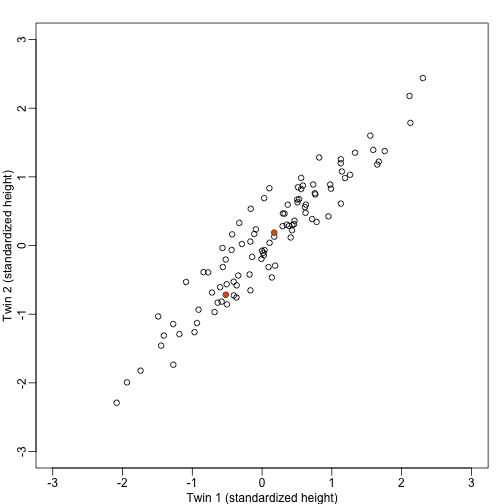
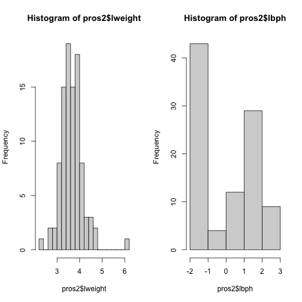
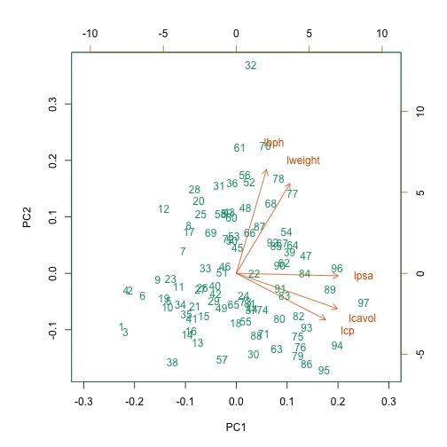
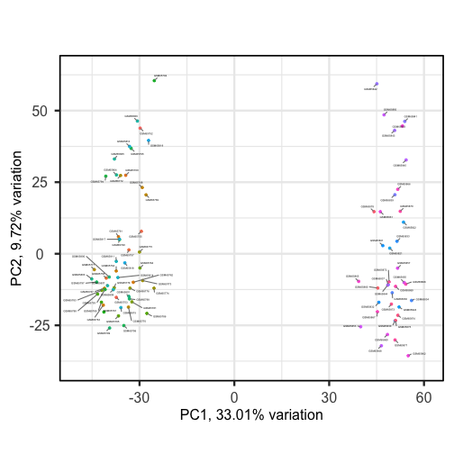
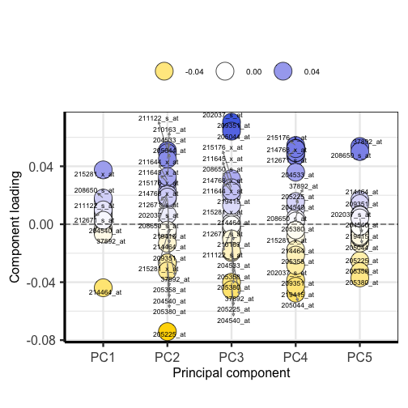
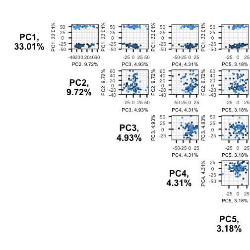

## Dimension Reduction Motivation

Visualizing data is one of the most, if not the most, important step in the 
analysis of high-throughput data. The right visualization method may reveal 
problems with the experimental data that can render the results from a standard 
analysis, although typically appropriate, completely useless. 

Recall that in recent history biologists went from using their eyes or simple 
summaries to categorize results, to having thousands (and now millions) of 
measurements per sample to analyze. Here we will focus on statistical inference 
in the context of high-throughput measurements, also called high-dimensional 
data. High-dimensional data is "wide" data, rather than long data, which has
few variables relative to the number of observations. The number of 
features (variables) in high-dimensional data is much greater than the number of
observations, making simple visualizations like scatterplots cumbersome.

We have shown methods for visualizing global properties of the columns or rows, 
but plots that reveal relationships between columns or between rows are more 
complicated due to the high dimensionality of data. For example, to compare each 
of the 189 samples to each other, we would have to create, for example, 17,766 
MA-plots. Creating one single scatterplot of the data is impossible since points 
are very high dimensional. 

We will describe powerful techniques for exploratory data analysis based on 
_dimension reduction_. The general idea is to reduce the dataset to have fewer 
dimensions, yet approximately preserve important properties, such as the 
distance between samples. If we are able to reduce down to, say, two dimensions, 
we can then easily make plots.

Principal component analysis (PCA) is a popular method of analyzing 
high-dimensional data. Large datasets of correlated variables can be summarized 
into smaller numbers of uncorrelated principal components that explain most of 
the variability in the original dataset. An example of PCA might be reducing 
several variables representing aspects of patient health (blood pressure, 
heart rate, respiratory rate) into a single feature.

PCA is a useful exploratory analysis tool. PCA allows us to reduce a large 
number of variables into a few features which represent most of the variation in 
the original variables. This makes exploration of the original variables easier.

The first principal component ($Z_1$) is calculated using the equation:

$$  
  Z_1 = a_{11}X_1 + a_{21}X_2 +....+a_{p1}X_p
$$

$X_1...X_p$ represents variables in the original dataset and $a_{11}...a_p$
represent principal component loadings, which can be thought of as the degree to
which each variable contributes to the calculation of the principal component.

> ## Exercise 1 
> 
> Descriptions of three datasets and research questions are given below. For
> which of these might PCA be considered a useful tool for analyzing data so
> that the research questions may be addressed?
> 
> 1. An epidemiologist has data collected from different patients admitted to
>    hospital with infectious respiratory disease. They would like to determine
>    whether length of stay in hospital differs in patients with different
>    respiratory diseases.
> 2. An online retailer has collected data on user interactions with its online
>    app and has information on the number of times each user interacted with
>    the app, what products they viewed per interaction, and the type and cost
>    of these products. The retailer would like to use this information to
>    predict whether or not a user will be interested in a new product.
> 3. A scientist has assayed gene expression levels in 1000 cancer patients and
>    has data from probes targeting different genes in tumour samples from
>    patients. She would like to create new variables representing relative
>    abundance of different groups of genes to i) find out if genes form
>    subgroups based on biological function and ii) use these new variables
>    in a linear regression examining how gene expression varies with disease
>    severity.
> 4. All of the above.
> 
> > ## Solution
> > In the first case, a regression model would be more suitable; perhaps a
> > survival model.
> > In the second, again a regression model, likely linear or logistic, would
> > be more suitable.
> > In the third example, PCA can help to identify modules of correlated
> > features that explain a large amount of variation within the data.
> >
> > Therefore the answer here is 3.
> {: .solution}
{: .challenge}

# What is a principal component?


```{r, eval=FALSE, echo=FALSE}
# A PCA is carried out by calculating a matrix of Pearson's correlations from
# the original dataset which shows how each of the variables in the dataset
# relate to each other.
```

The first principal component is the direction of the data along which the
observations vary the most. The second principal component is the direction of
the data along which the observations show the next highest amount of variation.
The second principal component is a linear combination of the variables that
is uncorrelated with the first principal component. There are as many principal
components as there are variables in your dataset, but as we'll see, some are
more useful at explaining your data than others. By definition, the first
principal component explains more variation than other principal components.

The animation below illustrates how principal components are calculated from
data. You can imagine that the black line is a rod and each red dashed line is
a spring. The energy of each spring is proportional to its squared length. The
direction of the first principal component is the one that minimizes the total
energy of all of the springs. In the animation below, the springs pull the rod,
finding the direction of the first principal component when they reach
equilibrium. We then use the length of the springs from the rod as the first
principal component.
This is explained in more detail on [this Q&A website](https://stats.stackexchange.com/questions/2691/making-sense-of-principal-component-analysis-eigenvectors-eigenvalues).


#### Example: Reducing two dimensions to one

We consider an example with twin heights. Here we simulate 100 two dimensional 
points that represent the number of standard deviations each individual is from 
the mean height. Each point is a pair of twins:

```{r simulate_twin_heights, fig.cap="Simulated twin pair heights.",echo=FALSE,message=FALSE}
library(rafalib)
library(MASS)

set.seed(1)
n <- 100
y=t(mvrnorm(n,c(0,0), matrix(c(1,0.95,0.95,1),2,2)))

mypar()
plot(y[1,], y[2,], xlab="Twin 1 (standardized height)", 
     ylab="Twin 2 (standardized height)", xlim=c(-3,3), ylim=c(-3,3))
points(y[1,1:2], y[2,1:2], col=2, pch=16)
```


To help with the illustration, think of this as high-throughput gene expression 
data with the twin pairs representing the $N$ samples and the two heights 
representing gene expression from two genes. 

We are interested in the distance between any two samples. We can compute this 
using `dist`. For example, here is the distance between the two orange points in 
the figure above:

```{r}
d=dist(t(y))
as.matrix(d)[1,2]
```

What if making two dimensional plots was too complex and we were only able to 
make 1 dimensional plots. Can we, for example, reduce the data to a one 
dimensional matrix that preserves distances between points?

If we look back at the plot, and visualize a line between any pair of points, 
the length of this line is the distance between the two points. These lines tend 
to go along the direction of the diagonal. We have seen before that we can 
"rotate" the plot so that the diagonal is in the x-axis by making a MA-plot 
instead:


```{r rotation, fig.cap="Twin height scatterplot (left) and MA-plot (right).",fig.width=10.5,fig.height=5.25}
z1 = (y[1,]+y[2,])/2 #the sum 
z2 = (y[1,]-y[2,])   #the difference

z = rbind( z1, z2) #matrix now same dimensions as y

thelim <- c(-3,3)
mypar(1,2)

plot(y[1,],y[2,],xlab="Twin 1 (standardized height)",
     ylab="Twin 2 (standardized height)",
     xlim=thelim,ylim=thelim)
points(y[1,1:2],y[2,1:2],col=2,pch=16)

plot(z[1,],z[2,],xlim=thelim,ylim=thelim,xlab="Average height",ylab="Difference in height")
points(z[1,1:2],z[2,1:2],col=2,pch=16)
```


 How do we perform a PCA?

## A prostate cancer dataset

The `Prostate` dataset is freely available online and represents data from 97
men who have prostate cancer. The data come from a study which examined the
correlation between the level of prostate specific antigen and a number of
clinical measures in men who were about to receive a radical prostatectomy.
The data have 97 rows and 9 columns.

Columns include:
- `lcavol` (log-transformed cancer volume),
- `lweight` (log-transformed prostate weight),
- `lbph` (log-transformed amount of benign prostate enlargement),
- `svi` (seminal vesicle invasion),
- `lcp` (log-transformed capsular penetration; amount of spread of cancer in
   outer walls of prostate),
- `gleason` (Gleason score; grade of cancer cells),
- `pgg45` (percentage Gleason scores 4 or 5),
- `lpsa` (log-tranformed prostate specific antigen; level of PSA in blood).
- `age` (patient age in years).

Here we will calculate principal component scores for each of the rows in this
dataset, using five principal components (one for each variable included in the
PCA). We will include five clinical variables in our PCA, each of the continuous
variables in the prostate dataset, so that we can create fewer variables
representing clinical markers of cancer progression. Standard PCAs are carried
out using continuous variables only.

First, we will examine the `Prostate` dataset which can be downloaded as part
of the **`lasso2`** package:

```{r lasso2, message=FALSE}
library("lasso2")
data("Prostate")
```

```{r prostate}
head(Prostate)
```

Note that each row of the dataset represents a single patient.

We will create a subset of the data including only the clinical variables we
want to use in the PCA.

```{r pros2}
pros2 <- Prostate[, c("lcavol", "lweight", "lbph", "lcp", "lpsa")]
head(pros2)
```

## Do we need to standardise the data?

Now we compare the variances between variables in the dataset.

```{r var-hist, fig.cap="Histograms comparing variances between log-transformed prostate weight and benign enlargement."}
apply(pros2, 2, var)
par(mfrow = c(1, 2))
hist(pros2$lweight, breaks = "FD")
hist(pros2$lbph, breaks = "FD")
```



Note that variance is greatest for `lbph` and lowest for `lweight`. It is clear
from this output that we need to scale each of these variables before including
them in a PCA analysis to ensure that differences in variances between variables
do not drive the calculation of principal components. In this example we
standardise all five variables to have a mean of 0 and a standard
deviation of 1. 


> ## Challenge 2
> 
> 
> Why might it be necessary to standardise variables before performing a PCA?  
> Can you think of datasets where it might not be necessary to standardise
> variables?
> Discuss.
> 
> 1. To make the results of the PCA interesting.
> 2. If you want to ensure that variables with different ranges of values
>    contribute equally to analysis.
> 3. To allow the feature matrix to be calculated faster, especially in cases
>    where there are a lot of input variables.
> 4. To allow both continuous and categorical variables to be included in the PCA.
> 5. All of the above.
> 
> > ## Solution
> > 
> > 2.
> > Scaling the data isn't guaranteed to make the results more interesting.
> > It also won't affect how quickly the output will be calculated, whether
> > continuous and categorical variables are present or not.
> > 
> > It is done to ensure that all features have equal weighting in the resulting
> > PCs.
> > 
> > You may not want to standardise datasets which contain continuous variables
> > all measured on the same scale (e.g. gene expression data or RNA sequencing
> > data). In this case, variables with very little sample-to-sample variability
> > may represent only random noise, and standardising the data would give
> > these extra weight in the PCA.
> > 
> {: .solution}
{: .challenge}

Next we will carry out a PCA using the `prcomp()` function in base R. The input
data (`pros2`) is in the form of a matrix. Note that the `scale = TRUE` argument
is used to standardise the variables to have a mean 0 and standard deviation of
1.

```{r prcomp}
pca.pros <- prcomp(pros2, scale = TRUE, center = TRUE)
pca.pros
```

# How many principal components do we need?

We have calculated one principal component for each variable in the original
dataset. How do we choose how many of these are necessary to represent the true
variation in the data, without having extra components that are unnecessary?

Let's look at the relative importance of each component using `summary`.

```{r summ}
summary(pca.pros)
```

```{R, echo = FALSE}
# Get proportions of variance explained by each PC (rounded to 2 DP)
prop.var <- round(summary(pca.pros)$importance["Proportion of Variance", ], 2) *
  100
```

This returns the proportion of variance in the data explained by each of the
(p = 5) principal components. In this example, PC1 explains approximately
`r prop.var[[1]]`% of variance in the data, PC2 `r prop.var[[2]]`% of variance,
PC3 a further `r prop.var[[3]]`%, PC4 approximately `r prop.var[[4]]`% and PC5
around `r prop.var[[5]]`%.

We can use a screeplot to see how much variation in the data is explained by
each principal component. Let's calculate the screeplot for our PCA.

```{r varexp}
# calculate variance explained
varExp <- (pca.pros$sdev^2) / sum(pca.pros$sdev^2) * 100
# calculate percentage variance explained using output from the PCA
varDF <- data.frame(Dimensions = 1:length(varExp), varExp = varExp)
# create new dataframe with five rows, one for each principal component
```

```{r vardf-plot, fig.cap="Screeplot showing proportion of variance explained by each principal component."}
plot(varDF)
```


The screeplot shows that the first principal component explains most of the
variance in the data (>50%) and each subsequent principal component explains
less and less of the total variance. The first two principal components
explain >70% of variance in the data. But what do these two principal
components mean?


## What are loadings and principal component scores?

The output from a PCA returns a matrix of principal component loadings in which
the columns show the principal component loading vectors. Note that the square
of values in each column sums to 1 as each loading is scaled so as to prevent a
blow up in variance. Larger values in the columns suggest a greater contribution
of that variable to the principal component. 

We can examine the output of our PCA by writing the following in `R`:

```{r pca-pros}
pca.pros
```

For each row in the original dataset PCA returns a principal component score
for each of the principal components (PC1 to PC5 in the `Prostate` data example).
We can see how the principal component score ($Z_{i1}$ for rows $i$ to $n$) is
calculated for the first principal component using the following equation from
Figure 1:

$$
  Z_{i1} = a_1 \times (lcavol_i - \overline{lcavol}) + a_2 \times (lpsa_i - \overline{lpsa})
$$

$a_1$ and $a_2$ represent principal component loadings in this equation.
A loading can be thought of as the 'weight' each variable has on the calculation
of the principal component. Note that in our example using the `Prostate`
dataset `lcavol` (log-transformed cancer volume) and `lpsa` (log-tranformed prostate specific antigen in blood) are the variables that contribute most to the first
principal component.

We can better understand what the principal components represent in terms of
the original variables by plotting the first two principal components against
each other and labelling points by patient number. Clusters of points which
have similar principal component scores can be observed using a biplot and the
strength and direction of influence different variables have on the calculation
of the principal component scores can be observed by plotting arrows
representing the loadings onto the graph.
A biplot of the first two principal components can be created as follows:

```{r stats-biplot, fig.cap="Biplot of first two principal components."}
biplot(pca.pros, xlim = c(-0.3, 0.3))
```



This biplot shows the position of each patient on a 2-dimensional plot where
loadings can be observed via the red arrows associated with each of
the variables. The variables `lpsa`, `lcavol` and `lcp` are associated with
positive values on PC1 while positive values on PC2 are associated with the
variables `lbph` and `lweight`. The length of the arrows indicates how much
each variable contributes to the calculation of each principal component.

The left and bottom axes show normalised principal component scores. The axes
on the top and right of the plot are used to interpret the loadings, where
loadings are scaled by the standard deviation of the principal components
(`pca.pros$sdev`) times the square root the number of observations.


# Using PCA to analyse gene expression data 

In this section you will carry out your own PCA using the Bioconductor package **`PCAtools`** 
applied to gene expression data to explore the topics covered above. 
**`PCAtools`** provides functions that can be used to explore data via PCA and
produce useful figures and analysis tools.

##  A gene expression dataset of cancer patients

The dataset we will be analysing in this lesson includes two subsets of data: 
* a matrix of gene expression data showing microarray results for different
  probes used to examine gene expression profiles in 91 different breast
  cancer patient samples.
* metadata associated with the gene expression results detailing information
  from patients from whom samples were taken.

Let's load the **`PCAtools`** package and the data.

```{r pcatools, message=FALSE}
library("PCAtools")
```

We will first load the microarray breast cancer gene expression data and
associated metadata, downloaded from the
[Gene Expression Omnibus](https://www.ncbi.nlm.nih.gov/geo/query/acc.cgi?acc=GSE2990).

```{r se, message=FALSE}
library("SummarizedExperiment")
cancer <- readRDS("../data/cancer_expression.rds")
mat <- assay(cancer)
metadata <- colData(cancer)
```

```{r mat, eval=FALSE}
View(mat)
#nrow=22215 probes
#ncol=91 samples
```

```{r meta, eval=FALSE}
View(metadata)
#nrow=91
#ncol=8
```

```{r colnames}
all(colnames(mat) == rownames(metadata))
#Check that column names and row names match
#If they do should return TRUE
```


The 'mat' variable contains a matrix of gene expression profiles for each sample.
Rows represent gene expression measurements and columns represent samples. The
'metadata' variable contains the metadata associated with the gene expression
data including the name of the study from which data originate, the age of the
patient from which the sample was taken, whether or not an oestrogen receptor
was involved in their cancer and the grade and size of the cancer for each
sample (represented by rows).

Microarray data are difficult to analyse for several reasons. Firstly, 
they are typically high-dimensional and therefore are subject to the same
difficulties associated with analysing high dimensional data outlined above
(i.e. *p*>*n*, large numbers of rows, multiple possible response variables,
curse of dimensionality). Secondly, formulating a research question using
microarray data can be difficult, especially if not much is known a priori
about which genes code for particular phenotypes of interest. Finally,
exploratory analysis, which can be used to help formulate research questions
and display relationships, is difficult using microarray data due to the number
of potentially interesting response variables (i.e. expression data from probes
targeting different genes).

If researchers hypothesise that groups of genes (e.g. biological pathways) may
be associated with different phenotypic characteristics of cancers (e.g.
histologic grade, tumour size), using statistical methods that reduce the
number of columns in the microarray matrix to a smaller number of dimensions
representing groups of genes would help visualise the data and address
research questions regarding the effect different groups of genes have on
disease progression.

Using the **`PCAtools`** we will apply a PCA to the cancer
gene expression data, plot the amount of variation in the data explained by
each principal component and plot the most important principal components
against each other as well as understanding what each principal component
represents.


> ## Challenge 3
> 
> Apply a PCA to the cancer gene expression data using the `pca()` function from
> **`PCAtools`**. You can use the help files in PCAtools to find out about the `pca()`
> function (type `help("pca")` or `?pca` in R).
> 
> Remove the lower 20% of principal components
> from your PCA using the `removeVar` argument in the `pca()` function.
>
> 
> As in the example using prostate data above, examine the first 5 rows and
> columns of rotated data and loadings from your PCA.
> 
> > ## Solution
> > 
> > ~~~
> > pc <- pca(mat, metadata = metadata)
> > #Many PCs explain a very small amount of the total variance in the data
> > #Remove the lower 20% of PCs with lower variance
> > pc <- pca(mat, metadata = metadata, removeVar = 0.2)
> > #Explore other arguments provided in pca
> > pc$rotated[1:5, 1:5]
> > pc$loadings[1:5, 1:5]
> > 
> > which.max(pc$loadings[, 1])
> > pc$loadings[49, ]
> > 
> > which.max(pc$loadings[, 2])
> > pc$loadings[27, ]
> > ~~~
> > {: .language-r}
> > The function `pca()` is used to perform PCA, and uses as inputs a matrix
> > (`mat`) containing continuous numerical data
> > in which rows are data variables and columns are samples, and `metadata`
> > associated with the matrix in which rows represent samples and columns
> > represent data variables. It has options to centre or scale the input data
> > before a PCA is performed, although in this case gene expression data do
> > not need to be transformed prior to PCA being carried out as variables are
> > measured on a similar scale (values are comparable between rows). The output
> > of the `pca()` function includes a lot of information such as loading values
> > for each variable (`loadings`), principal component scores (`rotated`)
> > and the amount of variance in the data
> > explained by each principal component.
> > 
> > Rotated data shows principal
> > component scores for each sample and each principal component. Loadings
> > the contribution each variable makes to each principal component. 
> {: .solution}
{: .challenge}

> ## Scaling variables for PCA
>
> When running `pca()` above, we kept the default setting, `scale=FALSE`. That means genes with higher variation in
> their expression levels should have higher loadings, which is what we are interested in.
> Whether or not to scale variables for PCA will depend on your data and research question.  
>
> Note that this is different from normalising gene expression data. Gene expression
> data have to be normalised before donwstream analyses can be
> carried out. This is to reduce to effect technical and other potentially confounding
> factors. We assume that the expression data we use had been noralised previously.
>
>{: .callout}

## Choosing how many components are important to explain the variance in the data

As in the example using the `Prostate` dataset we can use a screeplot to
compare the proportion of variance in the data explained by each principal
component. This allows us to understand how much information in the microarray
dataset is lost by projecting the observations onto the first few principal
components and whether these principal components represent a reasonable
amount of the variation. The proportion of variance explained should sum to one.

There are no clear guidelines on how many principal components should be
included in PCA: your choice depends on the total variability of the data and
the size of the dataset. We often look at the 'elbow’ on the screeplot as an
indicator that the addition of principal components does not drastically
contribute to explain the remaining variance or choose an arbitory cut off for
proportion of variance explained.

> ## Challenge 4
> 
> Using the `screeplot()` function in **`PCAtools`**, create a screeplot to show 
> proportion of variance explained by each principal component. Explain the
> output of the screeplot in terms of proportion of variance in data explained
> by each principal component.
> 
> > ## Solution
> > 
> > ~~~
> > screeplot(pc, axisLabSize = 5, titleLabSize = 8)
> > ~~~
> > {: .language-r}
> > Note that first principal component (PC1) explains more variation than
> > other principal components (which is always the case in PCA). The screeplot
> > shows that the first principal component only explains ~33% of the total
> > variation in the micrarray data and many principal components explain very 
> > little variation. The red line shows the cumulative percentage of explained
> > variation with increasing principal components. Note that in this case 18
> > principal components are needed to explain over 75% of variation in the
> > data. This is not an unusual result for complex biological datasets
> > including genetic information as clear relationships between groups are
> > sometimes difficult to observe in the data. The screeplot shows that using
> > a PCA we have reduced 91 predictors to 18 in order to explain a significant
> > amount of variation in the data. See additional arguments in screeplot
> > function for improving the appearance of the plot.
> {: .solution}
{: .challenge}

## Investigating the principal components 

Once the most important principal components have been identified using
`screeplot()`, these can be explored in more detail by plotting principal components
against each other and highlighting points based on variables in the metadata.
This will allow any potential clustering of points according to demographic or
phenotypic variables to be seen.

We can use biplots to look for patterns in the output from the PCA. Note that there
are two functions called `biplot()`, one in the package **`PCAtools`** and one in
**`stats`**. Both functions produce biplots but their scales are different!


> ## Challenge 5
> 
> Create a biplot of the first two principal components from your PCA
> (using `biplot()` function in **`PCAtools`** - see `help("PCAtools::biplot")` for arguments) 
> and examine whether the data appear to form clusters. Explain your results.
> 
> > ## Solution
> > 
> > ~~~
> > biplot(pc, lab = NULL, colby = 'Grade', legendPosition = 'top')
> > ~~~
> > {: .language-r}
> > The biplot shows the position of patient samples relative to PC1 and PC2
> > in a 2-dimensional plot. Note that two groups are apparent along the PC1
> > axis according to expressions of different genes while no separation can be
> > seem along the PC2 axis. Labels of patient samples are automatically added
> > in the biplot. Labels for each sample are added by default, but can be
> > removed if there is too much overlap in names. Note that **`PCAtools`** does
> > not scale biplot in the same way as biplot using the stats package.
> {: .solution}
{: .challenge}

Let's consider this biplot in more detail, and also display the loadings:

```{r pca-biplot, fig.cap="Biplot of principal components one and two showing two groups for PC1 according to gene expression."}
biplot(pc, lab = rownames(pc$metadata), pointSize = 1, labSize = 1)
```


Sizes of labels, points and axes can be changed using arguments in `biplot`
(see `help("biplot")`). We can see from the biplot that there appear to be two
separate groups of points that separate on the PC1 axis, but that no other
grouping is apparent on other PC axes.

```{r pca-loadings, fig.cap="Plot of principal component loadings show magnitude and direction of gene probes."}
plotloadings(pc, labSize = 3)
```



Plotting the loadings shows the magnitude and direction of loadings for probes
detecting genes on each principal component.

> ## Challenge 6
> 
> Use `colby` and `lab` arguments in `biplot()` to explore whether these two
> groups may cluster by patient age or by whether or not the sample expresses
> the oestrogen receptor gene (ER+ or ER-).
> 
> > ## Solution
> > 
> > ~~~
> >   biplot(pc,
> >     lab = paste0(pc$metadata$Age,'years'),
> >     colby = 'ER',
> >     hline = 0, vline = 0,
> >     legendPosition = 'right')
> > ~~~
> > {: .language-r}
> > It appears that one cluster has more ER+ samples than the other group.
> {: .solution}
{: .challenge}

So far we have only looked at a biplot of PC1 versus PC2 which only gives part
of the picture. The `pairplots()` function in **`PCAtools`** can be used to create
multiple biplots including different principal components.

```{r pairsplot, fig.cap="Pairsplot of principal components show clusters on PC1 only."}
pairsplot(pc)
```



The plots show two apparent clusters involving the first principal component
only. No other clusters are found involving other principal components.

# Using PCA output in further analysis

The output of PCA can be used to interpret data or can be used in further
analyses. For example, the PCA outputs new variables (principal components)
which represent several variables in the original dataset. These new variables
are useful for further exploring data, for example, comparing principal
component scores between groups or including the new variables in linear
regressions. Because the principal components are uncorrelated (and independent)
they can be included together in a single linear regression. 


> ## Principal component regression 
> 
> PCA is often used to reduce large numbers of correlated variables into fewer
> uncorrelated variables that can then be included in linear regression or
> other models. This technique is called principal component regression (PCR)
> and it allows researchers to examine the effect of several correlated
> explanatory variables on a single response variable in cases where a high
> degree of correlation initially prevents them from being included in the same
> model. This is called principal componenet regression (PCR) and is just one
> example of how principal components can be used in further analysis of data.
> When carrying out PCR, the variable of interest (response/dependent variable)
> is regressed against the principal components calculated using PCA, rather
> than against each individual explanatory variable from the original dataset.
> As there as many principal components created from PCA as there are variables
> in the dataset, we must select which principal components to include in PCR.
> This can be done by examining the amount of variation in the data explained
> by each principal component (see above).
{: .callout}